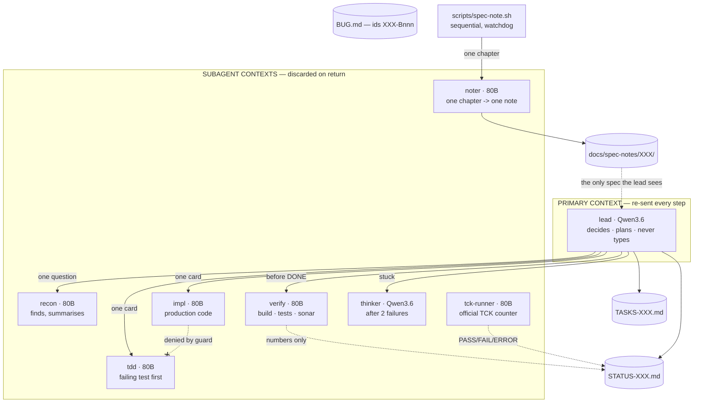
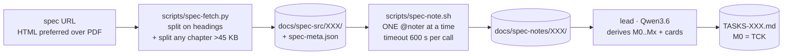
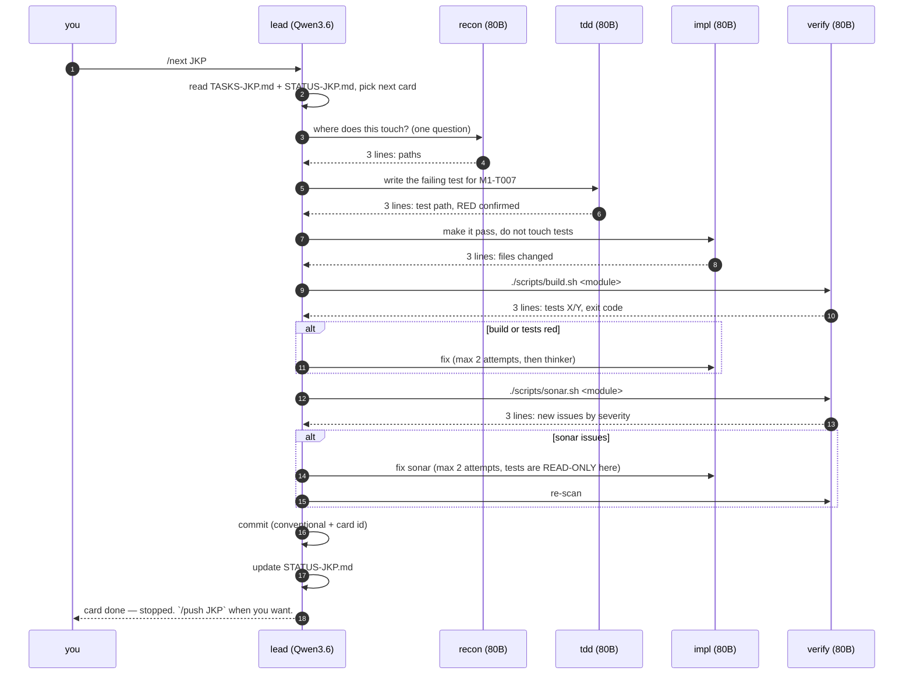
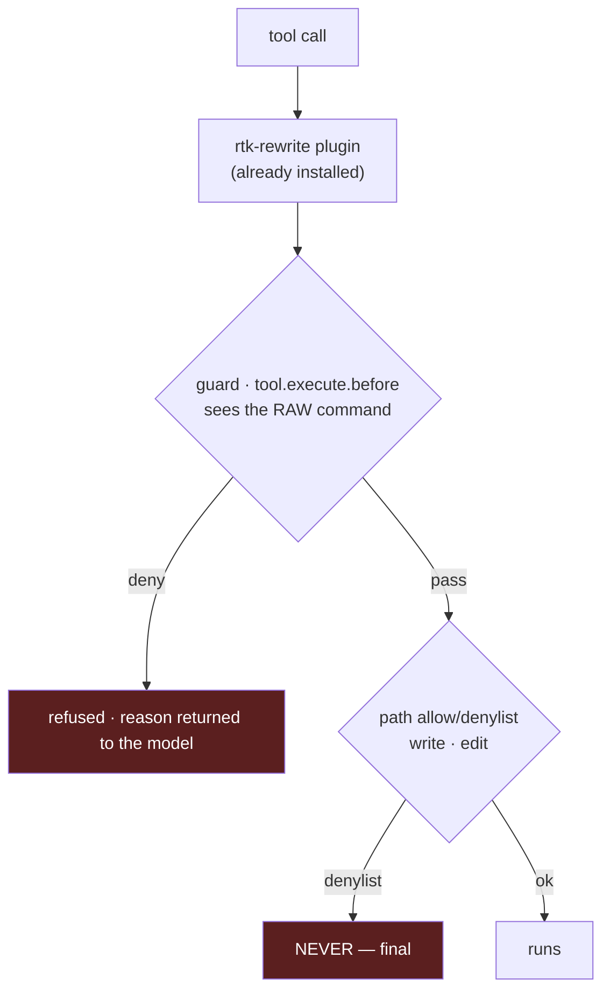

# OPENCODE_CODE_HARNESS — build plan

Design for the OpenCode harness on branch `ybl/jpa-opencode2`. Target: implement
Jakarta specs locally — Persistence 3.2 first, **any spec after** — with agent
contexts kept small on purpose.

Every rule below is anchored on a number measured on this machine, either from
the Vibe V3 session logs (`ybl/jpa-vibe:VIBE_V3.md`) or from the oMLX model bench
of 6–9 Sep 2026. Nothing here is a preference.

> **Reading order.** `AGENTS.md` is the one rulebook, and OpenCode injects it
> into **every** agent's context, subagents included (verified with a marker:
> `recon` quoted it without reading a file). So an agent file says only who the
> agent is and how it reports; a command says only which steps to take; every
> rule lives in `AGENTS.md`, once. Seventeen files that each restated the rules
> had drifted into contradicting each other — that is why the lead typed instead
> of delegating. Consolidated: 819 lines became ~490, and the war stories moved
> here, where humans read them. Agents do not read this file — and since this
> revision the guard refuses to open any `OPENCODE_*.md`, by the read tool or
> by `cat`/`sed`/`grep`: these files are the humans' trace of the project, not
> documentation, and one of them is a thousand lines of history poured into a
> context that is re-sent every step.

---

## 1. Why this shape

V3 measured, over 10 sessions and 1 701 steps, where the primary agent's context
actually came from:

| Source of primary context | Share |
| --- | --- |
| `read_file` | 42% |
| `bash` (build output, searches) | 28% |
| `write_file` + `edit` | 21% |
| `task` returns — real delegation | **4.6%** |

**72% of the primary's context was delegable work it did itself.** That single
asymmetry drives the whole design: a subagent's context is **discarded on
return**, the primary's is **re-sent on every step**.

Three pathologies, all measured, all of which the guard must make impossible:

- **218 `find` calls, 124 distinct** — the same `find … EntityModel.java` ran
  **75 times**, across three spellings differing only by a stderr redirect.
- **476 `read_file` calls, 40% of them re-reading an unchanged file.**
- **262 Maven runs, all logged `exit_code: 0`** — while 38 outputs contained
  `BUILD FAILURE`, 3 compile errors, 17 test failures. See §9.

---

## 2. Models

Two models stay resident: 22.0 + 47.1 = **69.1 GB**, under the ~84 GB oMLX model
ceiling, both answering without eviction (`max_concurrent_requests = 2`).
No swapping — swapping would throw away each model's prefix cache.

The split is not "big model for hard things". It follows **who pays what**: the
primary re-sends a long context every step, so it pays **prefill**; a subagent
starts fresh and short, so it pays **task wall-clock**.

| | Prefill @60k | Same code task |
| --- | --- | --- |
| `Qwen3.6-35B-A3B-MTPLX` (22 GB) | **2 515 tok/s** | 40 s, 4 700 tok (4 300 reasoning) — 10/10 |
| `Qwen3-Next-80B-Instruct-4bit` (47 GB) | 1 730 tok/s | **4.5 s, 348 tok** — 10/10 |

Same quality, opposite cost profiles. Hence:

| Agent | Model | Writes | Exists because |
| --- | --- | --- | --- |
| `lead` (primary) | Qwen3.6 | `TASKS-XXX.md`, `STATUS-XXX.md` | Decides and never types. Fastest prefill = cheapest primary. |
| `recon` | Instruct 80B | nothing | Answers "where is X" so the primary never greps. |
| `noter` | Instruct 80B | `docs/spec-notes/XXX/` only | `recon` may not write, and the lead must never hold a chapter. |
| `planner` | Instruct 80B | `.fragments/<group>.md` only | Turns one group of notes into card rows. Never sees the whole plan. |
| `tdd` | Instruct 80B | `**/src/test/**` only | Writes the failing test **before** the code. |
| `impl` | Instruct 80B | production code, never tests | 9× faster per task than the 35B, same score. |
| `verify` | Instruct 80B | nothing | Runs build/tests/Sonar, returns numbers only. |
| `thinker` | Qwen3.6 | nothing | Only after two failed attempts. Native thinking. |
| `tck-runner` | Instruct 80B | nothing | Runs the official TCK, reports the counter, fixes nothing. |

The 8B vision model is **not** in the roster, and neither is a PDF converter.
This section originally claimed oMLX exposed markitdown for spec PDFs — it does
not, and no converter exists on this machine. Jakarta publishes every spec as
HTML, which the fetcher now prefers: stdlib only, and headings survive the split.
Add vision only if a genuinely graphical diagram ever blocks a card.



**Every subagent returns a verdict of at most 3 lines.** Never raw build output,
never a file dump. The primary must never see a build log in its life — that is
the 28% `bash` line in §1.

---

## 3. Files, one set per spec

A spec gets a **three-letter code** (`JKP` = Jakarta Persistence). You pass it;
`/spec-add` refuses a code already present.

| File | Owner | Content |
| --- | --- | --- |
| `TASKS-XXX.md` | `spec-tasks.sh` | Milestones `M0..Mx`, cards `M0-T001`… Assembled by script from planner fragments; **no model writes this file**. |
| `docs/spec-src/XXX/milestones.tsv` | you | `<name><TAB><note globs>`, one line per milestone, **in dependency order**. The one judgement the script cannot make. |
| `docs/spec-src/XXX/module.conf` | you | Where the TCK runner module lives. Proposed by `tck-module.py` from the runners already in the repo, edited by a human, read by everything downstream. |
| `STATUS-XXX.md` | `lead` + `verify` | Current card, measured counters, one line per finished card. |
| `docs/spec-notes/XXX/<chapter>.md` | `noter` | One note per spec chapter, 200 lines max. The only thing read when planning. |
| `docs/spec-src/XXX/spec-meta.json` | `spec-fetch.py` | Chapter list **and TCK coordinates**. What makes the harness reusable: `/tck` reads it instead of guessing. |
| `tasks/XXX/<CARD>.md` | `lead`, agents | The per-card work order: what was read, decided, tried. Free form, never generated, never parsed. **This exists because an agent with something to write and no place to put it writes over whatever is nearest** — a lead overwrote the 248-card `TASKS-JKP.md` with a one-card brief. |
| `BUG.md` | `lead` | **Existing file, existing format** (34 entries). Bugs get ids `XXX-Bnnn`. |

No `BUGS-XXX.md`: the workspace `CLAUDE.md` already mandates one `BUG.md` per
sub-project, and two bug registers is how bugs get lost. The `XXX-` prefix gives
per-spec filtering for free.

---

## 4. Commands

| Command | Does |
| --- | --- |
| `/spec-add <url\|path> <XXX>` | Fetch → markitdown → split → one note per chapter → derive `TASKS-XXX.md` + empty `STATUS-XXX.md`. |
| `/tck XXX` | Wire the runner, run the official TCK, report the counter. Loops on `verify-m0.sh` until every card passes. |
| `/refresh XXX` | Re-measure and refresh `TASKS`/`STATUS` from what is true. Writes nothing itself — `verify-m0.sh` does both in one step, because anything generated goes stale the moment something changes and nobody remembers which script to re-run. |
| `/next XXX` | One card, end to end, then **stop**. |
| `/fixbug XXX-Bnnn` | Same engine, entry point is a `BUG.md` id instead of a card. |
| `/status XXX` | Read-only summary. No model call beyond formatting. |
| `/push XXX` | Explicit. `/next` commits, it never pushes (see §7). |

---

## 5. `/spec-add` — why it is a pipeline, not a read

A Jakarta spec is hundreds of pages. It does not fit a context, and "summarise
the spec" in one call dies of compaction before writing a single card.



The primary reads **only the notes**, never the spec. Each `noter` call is a
fresh short context that is thrown away. Restartable: a chapter whose note
already exists is skipped, so an interrupted run resumes where it stopped.

Four rules in that diagram were each bought with a failed run:

- **The dispatch loop is a shell, not the lead.** The lead once fired all 39
  noter calls at a server with `max_concurrent_requests: 2`: 9 active, 7 queued,
  prompt processing down from 1 730 to **170 tok/s**, and one call never came
  back — the run stayed "alive" for **51 minutes without writing a file**.
  Sequential is not the slow option: ~47 s per note, 24 chapters in ~20 min,
  against 90 minutes of nothing. **Do not parallelise AI calls against a server
  that serialises them** — no throughput gained, all observability lost.
- **A hard `timeout` per call.** A hung call must die in 600 s, not never.
- **Split any chapter over 45 KB.** Given 80 KB, a noter read it and replied
  *"what would you like me to do with this specification?"* — the spec had pushed
  its system prompt out of reach. The task is also repeated in the message.
- **Count `REPORTED-BUT-MISSING` separately from failure.** An agent claiming it
  wrote a file is not evidence; the script `ls` it afterwards. The final line is
  `notes: n/total written, n skipped, n timed out, n reported-but-missing`.

Front matter (preamble, license, bibliography, appendices) is filtered **by
pattern**, before any model call: 39 chapters become 24 at zero token cost.

### From notes to cards — the same lesson, one level up

The lead then had to turn 24 notes into `TASKS-XXX.md`, and failed three times
with **exit code 0 and no error**. Not a context problem: all 24 notes measure
**34 913 tokens** (server `count_tokens`) against a 65 536 limit, and it died at
21 000. The ceiling was `output: 12288` — a reasoning model asked to emit a
hundred-card document in one response, truncated mid-generation, surfacing as an
empty turn. Raising it to 32 768 moved the wall without removing it.

So `scripts/spec-tasks.sh` takes the document away from the model entirely:

- **one `@planner` call per milestone group**, sequential, watchdog per call;
- the planner emits **rows only** — `| title | spec sections | done-when |`;
- **no id column**: the script assigns `M3-T007`, so no model can invent a
  duplicate id;
- **rows that do not match the shape are deleted**, never trusted. Prose is
  dropped rather than assembled;
- **M0 is generated from `spec-meta.json` with no model at all.** A previous run
  wrote `jakarta.tack:persistence-tck` — a typo inside Maven coordinates, failing
  hours later for no visible reason. Coordinates are now copied by `python3`;
- **milestone order comes from `milestones.tsv`**, not from a model. Ordering is
  a judgement, so it lives in a ten-line file you can edit; fanning out calls is
  mechanical, so it lives in the shell;
- the script **counts what it cannot judge**: cards bundling 4+ requirements in
  one done-when, and duplicate titles across groups.

A dry run at `--timeout 1` — ten deliberate failures, zero tokens — caught the bug
that mattered: the loop processed *one* group and stopped, because `opencode` was
reading the TSV from stdin and swallowing it. `</dev/null` fixed it. Rehearse the
plumbing before spending a single token on it.

---

## 6. The pipeline as numbered steps

Every script above was, for a long time, only ordered inside my head and in chat
messages. That is not a harness — it is a habit. `scripts/steps/` makes the order
executable: each step is a thin wrapper that says what it does, calls the real
script, propagates its exit code, and **prints the next step**. Numbering leaves
gaps of ten so a step can be inserted without renaming the others.

| Step | Calls | In → out | Exit codes worth knowing |
| --- | --- | --- | --- |
| `STEP010_fetch_spec.sh <url> <XXX>` | `spec-fetch.py` | url → `docs/spec-src/XXX/` + `spec-meta.json` | 3 = only a PDF and no converter |
| `STEP020_note_chapters.sh <XXX>` | `spec-note.sh` | chapters → `docs/spec-notes/XXX/` | non-zero = a note is missing; re-run, it resumes |
| `STEP030_detect_tck.sh <XXX>` | `tck-find.py` | `spec-meta.json` → verdict | **0 = runnable, 1 = not installed** — information, not failure |
| `STEP040_install_tck.sh <XXX>` | `tck-install.py`, then `--refresh-tck` | spec page → jars in the M2 | 5 = no archive linked (WebFetch takes over) · 7 = JavaTest TCK, not Maven |
| `STEP050_module_path.sh <XXX>` | `tck-module.py` | repo layout → `module.conf` | 0, and **read the file — the name is yours** |
| `STEP060_plan_tasks.sh <XXX>` | `spec-tasks.sh` | notes + `milestones.tsv` → `TASKS`/`STATUS` | reports ORDER VIOLATION and shape counts |

Then the card loop is OpenCode's: `/tck XXX`, then `/next XXX` per card, each of
those using `scripts/build.sh` and `scripts/sonar.sh` — the two scripts that are
*not* pipeline steps, because they run inside every card rather than once.

Three properties on purpose. **Every step is re-runnable**: notes and fragments
are cached, `module.conf` is kept unless `--force`, progress in STATUS survives.
**Every step names the next one**, so neither a human nor an agent has to hold
the order. And **exit codes carry meaning rather than just failure** — STEP030
exiting 1 is the normal path to STEP040, which is exactly the distinction between
"no TCK installed" and "no TCK exists".

---

## 7. `/next XXX` — one card



Three deliberate constraints:

- **Test before code.** `tdd` writes a RED test; `impl` cannot write into
  `**/src/test/**` — enforced by path denylist, not by asking politely.
- **Sonar fix cannot touch tests.** The most tempting way to clear an issue is to
  delete the assertion. During the Sonar phase, tests are read-only for everyone.
- **Two attempts, then `thinker`.** No unbounded fix loops.
- **Commit yes, push no.** A commit is local and revertible; a push publishes. An
  unattended command should not publish. `/push XXX` is yours to type.

The commit is not free-form. The workspace `CLAUDE.md` mandates: message in
**English**, **Conventional Commits** + project ticket, **GPG-signed**, DCO
`Signed-off-by`, and a `Co-Authored-By` trailer naming the AI tool — author and
committer stay **the human alone**, the trailer being honest provenance, not
authorship. So a card commit looks like:

```
feat(persistence): add IdentityMap to the persistence context [JKP M1-T007]

Co-Authored-By: <local model / harness>
```

Commit with `git commit -S -s`: `-s` fills `Signed-off-by` from git config
(`yann@durand-blazart.fr` here). Never hardcode an identity in a command.

`git commit -S` must succeed or the card is not DONE — a failed signature is a
red build, not a warning.

---

## 8. The TCK is milestone zero

The first `TASKS-JKP.md` this harness generated contained **58 cards and zero
occurrences of the word "TCK"** — a plan describing what to implement, with no
way for anyone to know it worked. That is exactly how attempt 1 reached 2/1745
and attempt 3 marked 24 cards DONE against a real counter of 2.

The fix belongs in the harness, not in a hand-written module, or the next spec
starts from nothing again:

- **`scripts/tck-find.py <keyword> [--spec-version X.Y]`** scans the local M2 and
  **opens each candidate jar to count test classes**, because names lie:
  `persistence-tck` is a POM-only aggregator, `-dist` an 8 KB stub, `-common`
  156 KB of support code, and only `persistence-tck-spec-tests` holds the 161
  test classes. Recommending by name sent an agent after a coordinate that
  cannot resolve, and it made the build green by deleting the dependency. The
  recommendation now ships its evidence: `(161 test classes in the jar)`.
  Ranking by test count alone then picked a **4.0.0-SNAPSHOT** jar — 321 classes,
  the TCK of the *next* spec — so the spec version pins the TCK version
  (`spec-fetch.py` derives it from the URL) and a release beats a SNAPSHOT.
  **The TCK version comes from the spec, never from what happens to be
  installed.** `--spec-version` is a hard constraint, not a preference: `3.2`
  matches `3.2`, `3.2.1`, `3.2.2-SNAPSHOT`, never `4.0` and never `3.20`; no
  match returns nothing rather than something wrong. `spec-fetch.py` derives it
  from the URL, so `TitiToto 4.3` looks for the TitiToto 4.3 TCK.
  A lookup that finds nothing usable prints `NO RUNNABLE TCK: <reason>` and
  **exits 1** — the earlier version printed the artifact list, said nothing, and
  exited 0, which is the very failure this script exists to prevent.
  Verified: `data` → `jakarta.data:jakarta.data-tck:1.0.1`; `persistence 9.9`
  and an unknown keyword → exit 1 with the reason. It also surfaces the two runners
  that already pass here (`mansart-data-tck` at 74/74, `mansart-transactions-tck`),
  so an agent copies a working layout instead of inventing one.
- **`spec-fetch.py` writes the coordinates into `spec-meta.json`**, keyword and
  version derived from the url. `/tck` reads that file rather than guessing.
  **`spec-fetch.py <XXX> --refresh-tck`** redoes the lookup alone — no download,
  no re-split — because the TCK moves (installed, upgraded, purged) while the
  spec text never does. Without it, refreshing coordinates meant re-running the
  whole ingestion, and the shortcut was to hand-edit `spec-meta.json`: a file
  that is sometimes generated and sometimes typed is a file nobody can trust.
  It prints `before:` / `after:` and exits 1 when nothing runnable matches.
  Both scripts had the same argument bug: a flag taking a value
  (`--tck-keyword`, `--spec-version`) left that value in the positional list, so
  the command printed usage instead of running. Fixed in both; worth checking in
  any new script before blaming a model for "not calling it right".
- **`/tck XXX` + agent `tck-runner`**: runs, writes nothing, reports four lines.
  Written into its prompt: *ZERO PASS IS A VALID RESULT*, and `ERROR=all` (the
  harness does not compile) is not the same information as a conformance failure.
- **`scripts/tck-install.py <XXX>` obtains the TCK.** Nothing is hardcoded,
  because nothing *can* be — measured on three specs, the distribution names
  share no pattern: `jakarta-persistence-tck-3.2.1.zip`,
  `validation-tck-dist-3.1.1.zip`, `data-tck-1.0.0.zip`. A convention guessed
  from one fails on the other two. So the script **reads**: the spec landing page
  (one level up from the document url already in `spec-meta.json`) links its own
  TCK archive, the published `.sha256` verifies it, and every jar inside carries
  its exact coordinates in `META-INF/maven/<g>/<a>/pom.properties`. Discovery
  reads, it never infers. It ends by calling `tck-find.py`: **an install is not a
  metric**. Exit 5 — no archive linked — is the one point where an agent with
  WebFetch takes over, and even then it reports a url and stops.
  Verified end to end from an empty M2: 4.3 MB downloaded, sha256 verified,
  3/3 jars installed, 161 test classes confirmed.

  **Tested on nine specs, and the first version was wrong on two of them.**
  Discovery works 9/9 (persistence, data, bean-validation, transactions, cdi,
  jsonb, restful-ws, servlet, pages) — and the names confirm no pattern exists:
  `cdi-tck-4.1.0-dist.zip`, `validation-tck-dist-3.1.1.zip`,
  `jakarta-transactions-tck-2.0.0.zip`, `data-tck-1.0.0.zip`. Installation is
  the part that needed hardening:

  | spec | jars | installed | left alone |
  | --- | --- | --- | --- |
  | persistence 3.2 | 3 | 3 | — |
  | data 1.0 | 1 | 1 | — |
  | cdi 4.1 | 4 | 4 | — |
  | bean-validation 3.1 | 42 | 6 | 28 third-party, 8 without metadata |
  | transactions 2.0 | 13 | **0** | not a Maven TCK at all |

  Two rules came out of it. **A jar carrying coordinates is not necessarily
  ours**: the Bean Validation archive ships slf4j, jQuery, AssertJ; the
  Transactions archive's only jar with a `pom.properties` is
  `jaxen:jaxen:1.1.6`. Installing everything with metadata would pollute the M2
  with other projects' artifacts and still miss the TCK. And **a whole family of
  TCKs is not consumed through Maven**: Transactions 2.0 is a JavaTest/TSharness
  distribution — `lib/jtatck.jar` plus an Ant harness — which is *run*, not
  depended upon. The script detects it (0 installable jars), says so, exits 7,
  and points at `mansart-transactions-tck`, the runner of that family this repo
  already has.
- **`scripts/tck-module.py <XXX>` decides where the runner module goes**, because
  an agent left to itself created `ee/jakarta/tck/persistence/mansart-jkp-tck` —
  the TCK's own Java package path, with the harness's internal 3-letter code used
  as a Maven module name. Neither was forbidden anywhere. The repo already
  answers: `mansart-jakarta-data/mansart-data-tck`,
  `mansart-transactions/mansart-transactions-tck`, so the layout is
  `<top-level module>/<name>-tck`. The script tells the two shapes apart by
  looking — **at least one `*/*-tck` exists → multi-spec** (parent module plus
  tck submodule), **a root pom.xml and none → single-spec** (runner at the root)
  — and writes a *proposal* to `docs/spec-src/<XXX>/module.conf`, which a human
  edits: naming is a judgement (this repo says `mansart-jakarta-data` but
  `mansart-transactions`). M0-T001 then names the exact path, and `/tck` reads
  the file instead of choosing. **The module is two pieces, not one**: a parent
  in the reactor (`mansart-jakarta-data` is in the root pom's `<modules>`) and
  the runner inside it but *outside* the reactor (`mansart-data-tck` is not in
  the parent's). A run produced the leaf with no branch — a directory Maven never
  sees. M0-T001 now creates and registers the parent; M0-T002 creates the runner.
- **`scripts/verify-m0.sh <XXX>` decides whether an M0 card is done**, card by
  card, against **the card's own artifact**. It compiles the runner *in its own
  directory*, and looks for a counter naming *that module*. This exists because
  an agent recorded `./scripts/build.sh install → OK (exit 0), 10 tests, 0
  failures` as evidence for M0-T001: true in every word, and about the 26-module
  root reactor, which does not contain the out-of-reactor runner. The ten tests
  were `mansart-transactions`'. The module itself did not compile. My rule
  ("evidence is a log path, an exit code, a counter") constrained the *form* of
  the evidence while the defect was in its *referent*. Each M0 done-when is now
  "`verify-m0.sh <XXX>` reports M0-T00n PASS" — unsatisfiable by a build of
  something else.
- **M0's done rows are generated from `verify-m0.sh`, not written by an agent.**
  An agent recorded `| M0-T005 | PENDING | requires M1+ |` — an honest admission —
  and the milestone read **5 done**, because the counter counted rows. The harness
  overclaimed on the agent's behalf, against the agent's own words. Rows for other
  milestones are still appended by hand, but any row saying PENDING, BLOCKED or
  FAIL is dropped rather than counted.
- **"Copy a working runner" is only half an instruction.** A delivered runner
  still declared `<suite name="mansart-data-tck-1.0-official">`, scanned
  `ee.jakarta.tck.data.standalone.*` and included
  `**/standalone/entity/EntityTests.class` — three leftovers from Jakarta Data.
  The cards now list what must change after a copy: suite name, packages,
  surefire `<includes>`, artifactIds. And the fact none of that reveals:
  **Jakarta TCK test classes are named `Client`** (160 in the persistence jar),
  matching no default surefire pattern, so without
  `<include>**/Client.class</include>` the suite selects nothing and the build
  exits 0. `verify-m0.sh` prints that hint when a counter is missing — a checker
  that only says FAIL makes the next agent rediscover it.
- **`scripts/task-file.sh <XXX> <CARD>`** prints and creates the work-order path.
  Told the pattern `tasks/<XXX>/<CARD>.md`, an agent wrote `tasks/001/CARD.md`.
  A path an agent composes is a path an agent gets wrong — the third instance in
  this project, after the noter and the module directory.
- **A card must be achievable when it is scheduled.** M0-T001 once said "builds,
  exit 0" for a runner whose template depends on `-core`, `-cdi`, `-dialect-h2`
  — modules M1..M10 have not written yet. The agent could not satisfy it and
  marked it done anyway, with `Build fails with exit 1` in the evidence column.
  M0-T003 now reads "depend on the TCK **and on nothing that does not exist
  yet**", and STATUS states the rule: a row is written only when the done-when
  command exited 0.
- **M0 is a chain; M1..Mx are sets.** Each M0 card is the ground the next stands
  on — no parent module, no runner; no runner, no POM; no POM, no TCK
  dependency; no dependency, nothing for the wiring to assemble against. So a
  done M0-T004 with M0-T003 open describes a state that cannot exist, and
  `spec-tasks.sh` reports it as an **ORDER VIOLATION**, on stdout and in STATUS.
  The implementation milestones are deliberately *not* checked: "reject an entity
  class with no no-arg constructor" and "throw TransactionRequiredException
  outside a transaction" are independent, and forcing an order there would be
  false precision.
- **A counter is not a metric until you know what would change it.** M0-T005
  passed on 991 tests / 989 errors that all shared one cause: the TCK believed it
  ran inside a JakartaEE container and every test failed at setup demanding an
  injected EntityManager. That 989 would have stayed 989 whatever M1 implemented.
  Re-run with `platform.mode=standalone` the count is identical and the cause is
  *no persistence provider* — the number M1 actually moves. Hence **M0-T006**:
  `platform.mode=standalone`, `persistence.unit.name=JPATCK`, a `persistence.xml`
  declaring `JPATCK` and `JPATCK2`, and **no `<provider>` until ours exists** — a
  run shipped `org.eclipse.persistence.jpa.PersistenceProvider`, which measures
  EclipseLink's conformance, and a unit named `default` that the TCK never looks
  up.
- **Four ways to satisfy the metric without measuring anything**, all seen, all
  now checked: a local `Client.java` holding `assertTrue(true)` (its name matches
  the required include, so it reports a passing test while no TCK test runs); a
  foreign `<provider>`; an uncalibrated counter; and `<include>**/Client.class</include>`
  with **no `<dependenciesToScan>`** — the TCK classes live in a jar, and surefire
  scans only the module's own classes unless told otherwise, so the build exits 0
  with `Tests run: 0`. That last one is instructive: the runner had been correctly
  stripped of its Jakarta Data leftovers and lost the one thing the copy got right
  along with them. **Removing a copy's mistakes also removes what it did well.**
- **`verify-m0.sh` refreshes `STATUS` as part of verifying.** An agent committed a
  working runner while STATUS read `0 done` — the file was not even in its commit.
  Counts are computed at generation time, so they go stale the moment anything
  changes, and staying current depended on someone remembering which script to
  re-run. Measuring and recording are now one act. It paid on first use:
  `ORDER VIOLATION: M0-T006 is done but M0-T005 is not`, from rows nobody typed.
- **`/tck` finishes its own wiring.** A run stopped at five of six cards and
  reported success — obeying a step that said *"do not fix failures, that is
  /next"*, which conflated two opposite things. A **wiring** failure
  (`verify-m0.sh` FAIL: the instrument is not built) is `/tck`'s job; a
  **conformance** failure (the TCK counter) is `/next`'s. Step 3b is now a loop of
  up to six verify-and-fix rounds.
- **M0 is always the TCK**, before any implementation milestone, and it has three
  shapes because **"no TCK installed" is not "no TCK exists"** — the gap between
  those two is where a project invents a substitute metric:
  a runnable jar in the M2 → build the runner; the spec and version known but no
  jar → **M0-T001 is "obtain and install the official TCK", done-when
  `tck-find.py <kw> --spec-version <x.y>` exits 0 with >0 test classes**; nothing
  known at all → decide and document a metric, explicitly.
  The last card is always "the TCK produces a counter, ANY counter".

On spec dependencies, the answer was smaller than expected: **JNDI is not a
Jakarta spec** — `javax.naming` ships in the JDK. The TCK's `jakarta.tck:common`
drags in the whole EE platform (`ejb`, `jms`, `servlet`, `el`…), but that is the
shared base of every Jakarta TCK, not what JPA needs at runtime. What JPA actually
requires — Transactions, CDI, Annotations, JDBC, a pool — already exists in this
ecosystem as `mansart-transactions`, `vauban` and `mansart-pool`.

---

## 9. Enforcement, and the Maven exit-code fix

OpenCode 1.18.20 exposes `tool.execute.before` / `tool.execute.after` /
`permission.ask` (verified in `@opencode-ai/plugin`), so the V3 guard ports over.



**The guard normalises first**, then decides: strip a leading `cd X &&`, strip
`rtk`, strip trailing stderr redirects. V3 measured **730 of 1 312 bash calls
arriving through `rtk`**, and the 75 duplicate searches were spread over three
spellings — an exact string compare would have caught none of them.

Guard rules: deny direct/piped `mvn`; deny writes into TCK paths; deny a third
identical search in a session; deny re-reading a file unchanged since last read
(same mtime+size+window); deny `cat` of a file over 200 lines (use `sed -n`);
**deny `write`/`edit`/`patch` on a generated file** — `TASKS-*.md` and the
planner `.fragments/`; and **deny `grep` given a pattern starting with `-`**,
answering `use grep -e '<pattern>'` — an agent ran `grep "-suite.xml"` twice and
got `invalid option -- t` twice, two round trips for zero information. That last rule is the first one covering the write tools
rather than bash: an agent overwrote a 248-card plan with a one-card brief, and
the refusal now names `tasks/<XXX>/<CARD>.md` as the place to write instead.
Forbidding is half a fix; offering a destination is the other half.
Declared non-strict: **a crash in the guard lets the call through with a
warning**. A buggy guard must never brick a session; the path denylist stays the
hard guarantee.

### The exit-code bug — the one that matters

`mvn … | tail -5` returns **tail's** exit code, which is always 0. That is how
262 Maven runs were logged green while 38 had failed. Two fixes, both needed:

1. **`scripts/build.sh` is the only way to run Maven.** It sets `pipefail`, sends
   the full log to a file, prints ~5 lines (tests run/failed, first error), and
   **exits with Maven's real code**. This fixes the exit code *and* the 28%
   context share in one move.
2. **The guard denies any `mvn`/`mvnw` outside that script**, piped or not —
   because a permission denylist matches command prefixes *after* a tree-sitter
   parse has split on pipes, so it can never express "mvn must not be piped".
   Only a hook that sees the raw string can.

`scripts/sonar.sh` follows the same contract: module-scoped scan, short summary,
real exit code.

---

## 10. rtk and context-mode

- **rtk** stays: the `rtk-rewrite.js` plugin offers every bash command to
  `rtk rewrite`. The guard must therefore normalise `rtk` away before comparing
  commands (see §9), or duplicate-detection silently stops working.
- **context-mode** is how a subagent handles a large output without pouring it
  into a context: process it and print only the answer. Applies to build logs,
  Sonar reports, long greps. `verify` uses it by default; combined with
  `build.sh`, the primary sees numbers, never streams.

---

## 11. Measured environment facts

**SonarQube is up.** Container `vidocq-sonar`, image `sonarqube:community`,
version 26.5.0, **published on port 9001** (not 9000), volumes
`mansart-sonar-{data,logs,exts}`. It stops with OrbStack, so `scripts/sonar.sh`
must **start the container if needed and wait for `/api/system/status` = UP**
before scanning, instead of assuming it is running. Still missing: no
`sonar-maven-plugin` declared in any POM, and no project token — both are part of
the Sonar work item.

**Memory: two resident models fit, KV quantisation is not needed.** Measured with
Qwen3.6 *and* Instruct 80B loaded and a 60k context prefilled on each:

| | |
| --- | --- |
| weights reported by oMLX | 64.4 GB (ceiling grew to 107.5 GB) |
| system memory free | **85%** |
| prefill 60k while sharing | 2 056 tok/s (35B) · 1 583 tok/s (80B) |

So `turboquant_kv_enabled` stays **off**. It would trade throughput — on prefill,
which is exactly what the primary pays — to solve a pressure problem that does
not exist. Revisit only if both models ever need 120k contexts at the same time.
Note the cohabitation tax: prefill drops ~10-20% versus a model measured alone
(2 056 vs 2 515 for the 35B), which is the real price of keeping both resident,
and it is worth it against reload-per-switch.

**An oMLX upgrade wipes the prefix cache.** 0.6.2 → 0.6.4 took it from 42 GB to
12 MB. Any cache measurement spanning an upgrade compares two different machines;
`max_concurrent_requests` (2) and `hot_cache_max_size` (8 GB) survived it.

**Spec source is a URL, and HTML beats PDF.** `/spec-add <url> <XXX>` downloads
the spec and caches it under `docs/spec-src/XXX/`. Given a PDF url it switches to
the HTML edition Jakarta publishes alongside it — there is no PDF converter on
this machine, and HTML keeps the headings the splitter needs. Measured on JPA
3.2: 2.5 MB, 1.22 M characters, 20 chapters, 39 after the 45 KB split. `ee/` is
empty and no spec ships with the repo, so nothing is read from the working tree.

## 12. Built and verified so far

**Refusal works, and it teaches.** Verified end to end on 2026-09-09 with
`opencode run` against `Qwen3-Next-80B-Instruct`: throwing from
`tool.execute.before` refuses the call **and the message reaches the model**,
which corrected itself without being asked —

```
$ mvn -v
Error: mansart-guard: raw maven is denied. Use ./scripts/build.sh instead — …
$ ./scripts/build.sh -v            ← the model's own next move
OK (exit 0)
log: …/target/build-logs/build-20260909-115802-88440.log
```

So the guard is a teaching layer, not just a wall. Everything in §9 stands.

| Piece | State |
| --- | --- |
| `scripts/build.sh` | done — **10/10** on its contract, real failure → exit 1 + 3-line cause, 66-line log → 2 lines of stdout, JDK pinned from `.sdkmanrc` |
| `scripts/test-build-sh.sh` | done — run it before trusting any change to build.sh |
| `.sdkmanrc` | added (`java=25.0.3-tem`, `maven=3.9.16`), taken from `ybl/jpa-opencode` |
| `.opencode/guard-rules.mjs` | done — the six rules as pure functions, **outside `plugin/`** (see traps below) |
| `.opencode/plugin/mansart-guard.js` | done — wires the rules into `tool.execute.before` |
| `scripts/test-guard.mjs` | done — **44/44** |
| `scripts/spec-fetch.py` | done — HTML preferred, splits >45 KB chapters, writes `spec-meta.json` with TCK coordinates |
| `scripts/spec-note.sh` | done — 24 notes, **1 463 lines**, 35 min, 0 reported-but-missing |
| `scripts/spec-tasks.sh` | done — 11 milestones, **248 cards**, 10/10 groups, M0 generated with no model |
| `scripts/tck-find.py` | done — counts test classes in the jar; verified on `persistence`, `data`, and 9 specs for discovery |
| `scripts/tck-install.py` | done — discovers, verifies sha256, installs; 4 spec families tested, JavaTest family refused explicitly |
| `scripts/tck-module.py` | done — reads the repo layout, proposes `module.conf` |
| `scripts/steps/STEP0*.sh` | done — the six pipeline steps, each printing the next (see §6) |
| `scripts/verify-m0.sh` | done — six checks against each card's own artifact; refreshes STATUS as part of verifying |
| `scripts/task-file.sh` | done — prints and creates `tasks/<XXX>/<CARD>.md` |
| `.opencode/command/refresh.md` | done — `/refresh XXX` measures, records, reports four lines |
| `.opencode/package.json` | `{"type":"module"}`, else Node reparses the plugin on every load |
| `opencode.json` (project) | declares the two working models; **no secret** — baseURL and apiKey inherited from the global provider |
| `~/.config/opencode/opencode.json` | cleaned: it declared two models deleted from oMLX. Now the 5 real ones, default `Qwen3.6`, small/vision `Qwen3-VL-8B`. Backup kept as `opencode.json.BEFORE-CLEANUP-*` |

### Two traps found the hard way

**A plugin file must export exactly one symbol.** OpenCode loads *every* export
of a plugin file as a plugin, calls it with `{directory}`, and dies on the first
one returning `null` — `plugin config hook failed: null is not an object`, and
the whole session is lost. Exporting the rules next to the plugin killed every
run until they moved to `.opencode/guard-rules.js`. The test imports from there
too, so rules stay unit-testable without being loaded as plugins.

**rtk rewrites the command before the guard sees it.** `cat BUG.md` becomes
`rtk read BUG.md`; after `normalise()` strips the `rtk`, a `cat`-only pattern
matches nothing and the rule silently stops firing. Measured: `rtk read` does
**not** truncate (346 lines in, 346 out), so the rule is still needed — it now
matches `cat` and `read`. Any future rule must be written against the
**rewritten** form, not the one a human would type.

**JDK pinning.** `build.sh` resolves `java=` from `.sdkmanrc` and exports
`JAVA_HOME` itself, because an agent shell never runs `sdk env` — a run compiled
with Java 26 while the repo pins 25. A missing pinned JDK exits **78**
(EX_CONFIG): a machine problem, not a build failure. Every summary line now ends
with `jdk: <version>` so a wrong compiler is visible in the 3-line verdict.

Plugin discovery: `.opencode/plugin/` at the project root is picked up
(`[mansart-guard] loaded (dir=…)` on every run).

## 13. Agents and commands — written and loaded

`.opencode/agent/*.md` and `.opencode/command/*.md`, frontmatter + caveman English
body. `opencode agent list` shows all nine: `lead` (primary), `recon`, `noter`,
`planner`, `tdd`, `impl`, `verify`, `thinker`, `tck-runner` (subagents). Seven
commands: `/spec-add`, `/tck`, `/refresh`, `/next`, `/fixbug`, `/status`, `/push`.

Enforcement is layered, not repeated: `recon`/`verify`/`thinker`/`tck-runner`
have `tools: {write,edit,patch: false}` so they *cannot* write at all; `tdd`,
`impl` and `noter` can write, and stay in their lane by instruction plus the
guard. `noter` is the sharpest case: it is never *handed* an output path, it
**derives** it from the chapter path (`spec-src/XXX/f.md` → `spec-notes/XXX/f.md`).
A note once landed one directory too high, was reported as success, and held the
count at 8 of 11 for twenty minutes. You cannot mistype a path you never receive.

`scripts/sonar.sh` is written and **verified against the real server**: it starts
`vidocq-sonar` if OrbStack stopped it, waits for `status: UP`, and scans. Two
things learned running it:

- **The scanner refuses `-pl`** — *"Maven session does not declare a top level
  project"*. Scope with `-Dsonar.inclusions=<module>/**` instead.
- **The plugin is invoked by coordinates**, not declared in any POM, so the build
  stays clean for anyone who does not run Sonar. No POM change needed.
- Without `SONAR_TOKEN` it **skips with exit 0** and says so, rather than breaking
  `/next`.

`/status JKP` was run end to end: `$ARGUMENTS` substitutes, the command routes to
`lead`, and the output respects the required shape.

## 14. Open points

- **Card granularity is unsolved, and prompting will not solve it.** The pipeline
  produces 248 cards shaped like spec sections, 39 of them bundling four or more
  requirements in one done-when. Hardening the planner prompt (verb-first titles,
  one assertion per card, the failed example quoted with its correction) killed
  the duplicate titles (3+ → 0) and trimmed the count (309 → 248) but **left the
  shape untouched** — seven of ten groups returned the identical card count. The
  control run settles it: the 35B reasoning model produced **12 cards where the
  80B produced 54**, with the same defect. Two models, two architectures, one
  conclusion: **generating cards from section-structured notes is a
  structure-preserving transformation**. The `noter` works because its task is
  line-by-line; ask a model to group and arbitrate and it mirrors its input.
  Remaining options, both untried: a deterministic splitter (one card per note
  line — 1 463 cards, worse), or letting `/next` split a card at execution time.
- **Note density is proven.** 24 notes, 1 463 lines, against 367 lines for 11
  chapters before the 45 KB split. That fix worked.
- **The roster may have the models backwards for `noter`.** Under load, the lead
  replaying a near-identical context reaches **17 250 tok/s** of apparent prefill
  (almost all cache hits), while the noter, reading 39 different chapters, gets
  **274 tok/s** with no cache at all. The role that benefits least from the prefix
  cache was handed to the model that prefills slowest. Testable — same chapter,
  both models — and untested.
- **`/tck` has run once; `/next` never.** The run built a correct runner module
  (build.sh test-compile exit 0, verified) but produced **one test, one skipped**
  — zero official tests, so no counter at all, which is not the same thing as
  `PASS=0`. M0-T002 was "satisfied" by deleting the TCK dependency; the card now
  says in its own text that this is not a fix.
- **The M2 has been purged of the Jakarta Persistence TCK** (41 MB, backed up
  outside the repository). A harness that only works with the suite pre-installed
  by hand proves nothing, so M0-T001 is now "install it" and the whole chain is
  exercised from zero. Nothing about JPA resolves from the local M2 today.
- **No per-agent enforcement exists — measured, not assumed.** Two probes:
  `tool.execute.before` receives exactly `["tool","sessionID","callID"]`, so the
  guard cannot tell the lead from `@impl`; and a per-path `permission.edit` map
  (`"**/*.java": deny`) is silently ignored — the agent wrote the file and
  reported success. So both "`impl` must not touch tests" and "the lead must not
  type code" are written rules with no enforcer, which is why the lead does most
  of the typing itself. The route that remains is structural: a shell calling
  `@impl` once per artifact, as `spec-note.sh` and `spec-tasks.sh` already did for
  two other loops. Not built.
- **Delivered modules are frozen, by the guard.** A `/tck` run "fixed" a junit
  version in `mansart-jakarta-data/pom.xml` and
  `mansart-transactions/mansart-transactions-tests/pom.xml` — two delivered,
  TCK-passing modules — on its way to wiring the persistence runner. The plugin
  now computes at load *root `<modules>` minus every parent named in a
  `module.conf`* and refuses any write under the rest; verified end to end (the
  model was denied and explained the rule back). `verify-m0.sh` adds a SCOPE
  check that fails the run if `git status` shows files outside the spec's lane.
- **The agent files contradicted each other, which is why the lead typed.**
  `impl.md` said *never touch `*-tck/`* while `/tck` asked `@impl` to create the
  runner; `AGENTS.md` said `*-tck/` is read-only forever; `lead.md` said the lead
  writes `TASKS`/`STATUS`/notes, three files it may no longer touch; `/tck`
  still told the lead to append STATUS rows that `verify-m0.sh` now writes, and
  named a chain ending at T005 with six cards. Resolved: the *suite* is
  read-only, the *runner* is ours and `impl` builds it; the lead writes only
  `tasks/<XXX>/<CARD>.md`; `/tck` is a verify-and-fix loop with four explicit
  `@impl` calls and no STATUS writes at all.
- **`STEP070_wire_tck.sh` drives the four `impl` calls; the lead only runs it.**
  Asked to delegate, the lead read the references itself and wrote the four
  delegations as text, then ended its turn (trace in OpenCode's SQLite store:
  zero child sessions). A shell dispatches: four sequential `opencode run
  --agent impl` calls with a watchdog, then verify-and-fix rounds. First real
  run: 5/6 in ninety seconds, all written by `impl`.
- **An error message an agent acts on is an instruction.** *"no counter from
  the OFFICIAL suite (ee.jakarta.tck.*)"* made `impl` rewrite the Maven groupId
  to `ee.jakarta.tck` — the Java package — in the pom and in `spec-meta.json`.
  Messages now name the exact expected value and say what the look-alike is;
  the guard protects `spec-meta.json` and refuses a `Client.java` in a runner;
  the include must be exactly `**/Client.class`; no suite run without a compiling
  module.
- **`STEP040` is idempotent and `tck-install.py` tells a failed install from a
  non-Maven archive.** A run called the install step with the TCK already
  installed; the re-install failed three times because `install-file` ran from
  the repository root, where Maven loads the reactor and its parent chain
  (`org.sonatype.oss:oss-parent:11`, unresolvable that morning); the script
  reported "not a Maven TCK", exit 7, and the lead — correctly — stopped. Now:
  already runnable → exit 0 without doing anything; install runs from an empty
  temp dir (no project needed); every-install-failed → exit 8 with the log.
- **The TCK's test framework is read from the jar, and the runner must declare
  its provider.** Surefire auto-detects its provider from the classpath: a runner
  declaring only TestNG (copied from `mansart-data-tck`) ran the Persistence 3.2
  suite as `Tests run: 0, BUILD SUCCESS` — the `Client` classes are JUnit 5 (118
  classes reference `org.junit.jupiter`, 0 `org.testng`; data 1.0: 22 / 0, its
  TestNG is a leftover). `tck-find.py` records `test_framework` in
  `spec-meta.json`; `verify-m0.sh` requires `org.junit.jupiter:junit-jupiter`
  (or `org.testng:testng`) accordingly and quotes the `Using auto detected
  provider` line when it is wrong; `STEP070` states it in the wiring prompt.
- **No single `/tck` run has completed M0 unaided.** The six cards were reached
  across several runs, each ending in a harness fix rather than a module fix. The
  tree is reset so the claim can actually be tested.
- **Thermal drift**: this machine loses up to 61% throughput after ~1 h of
  sustained load and recovers in ~3 min idle. It does not change the design, but
  it explains slow sessions — and it invalidates any benchmark run back-to-back.
  See the `omlx-model-bench` memory.
