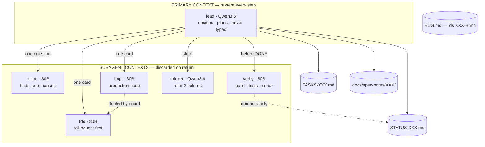
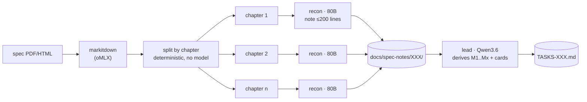
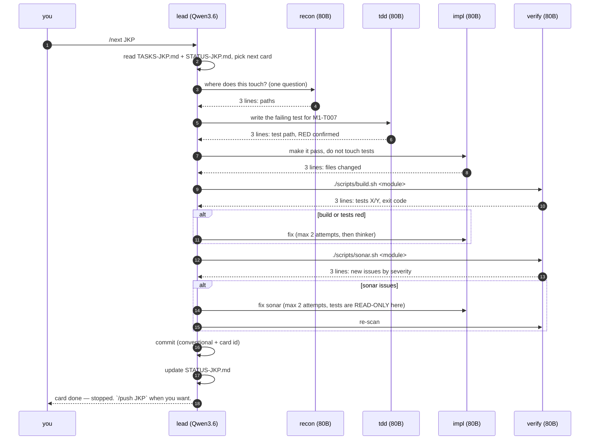
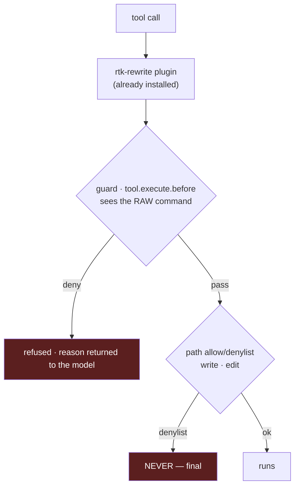

# OPENCODE_CODE_HARNESS — build plan

Design for the OpenCode harness on branch `ybl/jpa-opencode2`. Target: implement
Jakarta specs locally — Persistence 3.2 first, **any spec after** — with agent
contexts kept small on purpose.

Every rule below is anchored on a number measured on this machine, either from
the Vibe V3 session logs (`ybl/jpa-vibe:VIBE_V3.md`) or from the oMLX model bench
of 6–9 Sep 2026. Nothing here is a preference.

> **Reading order.** `AGENTS.md` is the contract agents load; it is short and
> written in caveman English. This file is the reasoning behind it, for humans.
> Agents do not read this file.

---

## 1. Why this shape

V3 measured, over 10 sessions and 1 701 steps, where the primary agent's context
actually came from:

| Source of primary context | Share |
| --- | --- |
| `read_file` | 42% |
| `bash` (build output, searches) | 28% |
| `write_file` + `edit` | 21% |
| `task` returns — real delegation | **4.6%** |

**72% of the primary's context was delegable work it did itself.** That single
asymmetry drives the whole design: a subagent's context is **discarded on
return**, the primary's is **re-sent on every step**.

Three pathologies, all measured, all of which the guard must make impossible:

- **218 `find` calls, 124 distinct** — the same `find … EntityModel.java` ran
  **75 times**, across three spellings differing only by a stderr redirect.
- **476 `read_file` calls, 40% of them re-reading an unchanged file.**
- **262 Maven runs, all logged `exit_code: 0`** — while 38 outputs contained
  `BUILD FAILURE`, 3 compile errors, 17 test failures. See §7.

---

## 2. Models

Two models stay resident: 22.0 + 47.1 = **69.1 GB**, under the ~84 GB oMLX model
ceiling, both answering without eviction (`max_concurrent_requests = 2`).
No swapping — swapping would throw away each model's prefix cache.

The split is not "big model for hard things". It follows **who pays what**: the
primary re-sends a long context every step, so it pays **prefill**; a subagent
starts fresh and short, so it pays **task wall-clock**.

| | Prefill @60k | Same code task |
| --- | --- | --- |
| `Qwen3.6-35B-A3B-MTPLX` (22 GB) | **2 515 tok/s** | 40 s, 4 700 tok (4 300 reasoning) — 10/10 |
| `Qwen3-Next-80B-Instruct-4bit` (47 GB) | 1 730 tok/s | **4.5 s, 348 tok** — 10/10 |

Same quality, opposite cost profiles. Hence:

| Agent | Model | Writes | Exists because |
| --- | --- | --- | --- |
| `lead` (primary) | Qwen3.6 | `TASKS-XXX.md`, `STATUS-XXX.md`, `docs/spec-notes/` | Decides and never types. Fastest prefill = cheapest primary. |
| `recon` | Instruct 80B | nothing | Answers "where is X" so the primary never greps. |
| `tdd` | Instruct 80B | `**/src/test/**` only | Writes the failing test **before** the code. |
| `impl` | Instruct 80B | production code, never tests | 9× faster per task than the 35B, same score. |
| `verify` | Instruct 80B | nothing | Runs build/tests/Sonar, returns numbers only. |
| `thinker` | Qwen3.6 | nothing | Only after two failed attempts. Native thinking. |

The 8B vision model is **not** in the roster: oMLX has markitdown enabled
(PDF → text, 25 MB, 5 files/request), which covers spec PDFs. Add vision only if
a genuinely graphical diagram ever blocks a card.



**Every subagent returns a verdict of at most 3 lines.** Never raw build output,
never a file dump. The primary must never see a build log in its life — that is
the 28% `bash` line in §1.

---

## 3. Files, one set per spec

A spec gets a **three-letter code** (`JKP` = Jakarta Persistence). You pass it;
`/spec-add` refuses a code already present.

| File | Owner | Content |
| --- | --- | --- |
| `TASKS-XXX.md` | `lead` | Milestones `M1..Mx`, cards `M1-T001`, `M1-T002`… Normal English, this is the contract. |
| `STATUS-XXX.md` | `lead` + `verify` | Current card, measured counters, one line per finished card. |
| `docs/spec-notes/XXX/<chapter>.md` | `lead` | One note per spec chapter, 200 lines max. The only thing read when planning. |
| `BUG.md` | `lead` | **Existing file, existing format** (34 entries). Bugs get ids `XXX-Bnnn`. |

No `BUGS-XXX.md`: the workspace `CLAUDE.md` already mandates one `BUG.md` per
sub-project, and two bug registers is how bugs get lost. The `XXX-` prefix gives
per-spec filtering for free.

---

## 4. Commands

| Command | Does |
| --- | --- |
| `/spec-add <url\|path> <XXX>` | Fetch → markitdown → split → one note per chapter → derive `TASKS-XXX.md` + empty `STATUS-XXX.md`. |
| `/next XXX` | One card, end to end, then **stop**. |
| `/fixbug XXX-Bnnn` | Same engine, entry point is a `BUG.md` id instead of a card. |
| `/status XXX` | Read-only summary. No model call beyond formatting. |
| `/push XXX` | Explicit. `/next` commits, it never pushes (see §6). |

---

## 5. `/spec-add` — why it is a pipeline, not a read

A Jakarta spec is hundreds of pages. It does not fit a context, and "summarise
the spec" in one call dies of compaction before writing a single card.



The primary reads **only the notes**, never the spec. Each `recon` call is a
fresh short context that is thrown away. Restartable: a chapter whose note
already exists is skipped.

---

## 6. `/next XXX` — one card



Three deliberate constraints:

- **Test before code.** `tdd` writes a RED test; `impl` cannot write into
  `**/src/test/**` — enforced by path denylist, not by asking politely.
- **Sonar fix cannot touch tests.** The most tempting way to clear an issue is to
  delete the assertion. During the Sonar phase, tests are read-only for everyone.
- **Two attempts, then `thinker`.** No unbounded fix loops.
- **Commit yes, push no.** A commit is local and revertible; a push publishes. An
  unattended command should not publish. `/push XXX` is yours to type.

The commit is not free-form. The workspace `CLAUDE.md` mandates: message in
**English**, **Conventional Commits** + project ticket, **GPG-signed**, DCO
`Signed-off-by`, and a `Co-Authored-By` trailer naming the AI tool — author and
committer stay **the human alone**, the trailer being honest provenance, not
authorship. So a card commit looks like:

```
feat(persistence): add IdentityMap to the persistence context [JKP M1-T007]

Co-Authored-By: <local model / harness>
```

Commit with `git commit -S -s`: `-s` fills `Signed-off-by` from git config
(`yann@durand-blazart.fr` here). Never hardcode an identity in a command.

`git commit -S` must succeed or the card is not DONE — a failed signature is a
red build, not a warning.

---

## 7. Enforcement, and the Maven exit-code fix

OpenCode 1.18.20 exposes `tool.execute.before` / `tool.execute.after` /
`permission.ask` (verified in `@opencode-ai/plugin`), so the V3 guard ports over.



**The guard normalises first**, then decides: strip a leading `cd X &&`, strip
`rtk`, strip trailing stderr redirects. V3 measured **730 of 1 312 bash calls
arriving through `rtk`**, and the 75 duplicate searches were spread over three
spellings — an exact string compare would have caught none of them.

Guard rules: deny direct/piped `mvn`; deny writes into TCK paths; deny a third
identical search in a session; deny re-reading a file unchanged since last read
(same mtime+size+window); deny `cat` of a file over 200 lines (use `sed -n`).
Declared non-strict: **a crash in the guard lets the call through with a
warning**. A buggy guard must never brick a session; the path denylist stays the
hard guarantee.

### The exit-code bug — the one that matters

`mvn … | tail -5` returns **tail's** exit code, which is always 0. That is how
262 Maven runs were logged green while 38 had failed. Two fixes, both needed:

1. **`scripts/build.sh` is the only way to run Maven.** It sets `pipefail`, sends
   the full log to a file, prints ~5 lines (tests run/failed, first error), and
   **exits with Maven's real code**. This fixes the exit code *and* the 28%
   context share in one move.
2. **The guard denies any `mvn`/`mvnw` outside that script**, piped or not —
   because a permission denylist matches command prefixes *after* a tree-sitter
   parse has split on pipes, so it can never express "mvn must not be piped".
   Only a hook that sees the raw string can.

`scripts/sonar.sh` follows the same contract: module-scoped scan, short summary,
real exit code.

---

## 8. rtk and context-mode

- **rtk** stays: the `rtk-rewrite.js` plugin offers every bash command to
  `rtk rewrite`. The guard must therefore normalise `rtk` away before comparing
  commands (see §7), or duplicate-detection silently stops working.
- **context-mode** is how a subagent handles a large output without pouring it
  into a context: process it and print only the answer. Applies to build logs,
  Sonar reports, long greps. `verify` uses it by default; combined with
  `build.sh`, the primary sees numbers, never streams.

---

## 9. Measured environment facts

**SonarQube is up.** Container `vidocq-sonar`, image `sonarqube:community`,
version 26.5.0, **published on port 9001** (not 9000), volumes
`mansart-sonar-{data,logs,exts}`. It stops with OrbStack, so `scripts/sonar.sh`
must **start the container if needed and wait for `/api/system/status` = UP**
before scanning, instead of assuming it is running. Still missing: no
`sonar-maven-plugin` declared in any POM, and no project token — both are part of
the Sonar work item.

**Memory: two resident models fit, KV quantisation is not needed.** Measured with
Qwen3.6 *and* Instruct 80B loaded and a 60k context prefilled on each:

| | |
| --- | --- |
| weights reported by oMLX | 64.4 GB (ceiling grew to 107.5 GB) |
| system memory free | **85%** |
| prefill 60k while sharing | 2 056 tok/s (35B) · 1 583 tok/s (80B) |

So `turboquant_kv_enabled` stays **off**. It would trade throughput — on prefill,
which is exactly what the primary pays — to solve a pressure problem that does
not exist. Revisit only if both models ever need 120k contexts at the same time.
Note the cohabitation tax: prefill drops ~10-20% versus a model measured alone
(2 056 vs 2 515 for the 35B), which is the real price of keeping both resident,
and it is worth it against reload-per-switch.

**Spec source is a URL.** `/spec-add <url-to-pdf> <XXX>` downloads the spec PDF,
caches it locally, and feeds it to markitdown. `ee/` is empty and no spec ships
with the repo, so nothing is read from the working tree.

## 10. Built and verified so far

**Refusal works, and it teaches.** Verified end to end on 2026-09-09 with
`opencode run` against `Qwen3-Next-80B-Instruct`: throwing from
`tool.execute.before` refuses the call **and the message reaches the model**,
which corrected itself without being asked —

```
$ mvn -v
Error: mansart-guard: raw maven is denied. Use ./scripts/build.sh instead — …
$ ./scripts/build.sh -v            ← the model's own next move
OK (exit 0)
log: …/target/build-logs/build-20260909-115802-88440.log
```

So the guard is a teaching layer, not just a wall. Everything in §7 stands.

| Piece | State |
| --- | --- |
| `scripts/build.sh` | done — **10/10** on its contract, real failure → exit 1 + 3-line cause, 66-line log → 2 lines of stdout, JDK pinned from `.sdkmanrc` |
| `scripts/test-build-sh.sh` | done — run it before trusting any change to build.sh |
| `.sdkmanrc` | added (`java=25.0.3-tem`, `maven=3.9.16`), taken from `ybl/jpa-opencode` |
| `.opencode/guard-rules.js` | done — the six rules as pure functions |
| `.opencode/plugin/mansart-guard.js` | done — wires the rules into `tool.execute.before` |
| `scripts/test-guard.mjs` | done — **44/44** |
| `.opencode/package.json` | `{"type":"module"}`, else Node reparses the plugin on every load |
| `opencode.json` (project) | declares the two working models; **no secret** — baseURL and apiKey inherited from the global provider |
| `~/.config/opencode/opencode.json` | cleaned: it declared two models deleted from oMLX. Now the 5 real ones, default `Qwen3.6`, small/vision `Qwen3-VL-8B`. Backup kept as `opencode.json.BEFORE-CLEANUP-*` |

### Two traps found the hard way

**A plugin file must export exactly one symbol.** OpenCode loads *every* export
of a plugin file as a plugin, calls it with `{directory}`, and dies on the first
one returning `null` — `plugin config hook failed: null is not an object`, and
the whole session is lost. Exporting the rules next to the plugin killed every
run until they moved to `.opencode/guard-rules.js`. The test imports from there
too, so rules stay unit-testable without being loaded as plugins.

**rtk rewrites the command before the guard sees it.** `cat BUG.md` becomes
`rtk read BUG.md`; after `normalise()` strips the `rtk`, a `cat`-only pattern
matches nothing and the rule silently stops firing. Measured: `rtk read` does
**not** truncate (346 lines in, 346 out), so the rule is still needed — it now
matches `cat` and `read`. Any future rule must be written against the
**rewritten** form, not the one a human would type.

**JDK pinning.** `build.sh` resolves `java=` from `.sdkmanrc` and exports
`JAVA_HOME` itself, because an agent shell never runs `sdk env` — a run compiled
with Java 26 while the repo pins 25. A missing pinned JDK exits **78**
(EX_CONFIG): a machine problem, not a build failure. Every summary line now ends
with `jdk: <version>` so a wrong compiler is visible in the 3-line verdict.

Plugin discovery: `.opencode/plugin/` at the project root is picked up
(`[mansart-guard] loaded (dir=…)` on every run).

## 11. Agents and commands — written and loaded

`.opencode/agent/*.md` and `.opencode/command/*.md`, frontmatter + caveman English
body. `opencode agent list` shows all six: `lead` (primary), `recon`, `tdd`,
`impl`, `verify`, `thinker` (subagents).

Enforcement is layered, not repeated: `recon`/`verify`/`thinker` have
`tools: {write,edit,patch: false}` so they *cannot* write at all; `tdd` and `impl`
can write, and stay in their lane by instruction plus the guard.

`scripts/sonar.sh` is written and **verified against the real server**: it starts
`vidocq-sonar` if OrbStack stopped it, waits for `status: UP`, and scans. Two
things learned running it:

- **The scanner refuses `-pl`** — *"Maven session does not declare a top level
  project"*. Scope with `-Dsonar.inclusions=<module>/**` instead.
- **The plugin is invoked by coordinates**, not declared in any POM, so the build
  stays clean for anyone who does not run Sonar. No POM change needed.
- Without `SONAR_TOKEN` it **skips with exit 0** and says so, rather than breaking
  `/next`.

`/status JKP` was run end to end: `$ARGUMENTS` substitutes, the command routes to
`lead`, and the output respects the required shape.

## 12. Open points

- **`/spec-add` is untested end to end** — no spec PDF has been ingested yet. The
  markitdown call in step 2 is the part most likely to need adjusting.
- **`impl` writing into `src/test/` is prevented by instruction, not by tooling.**
  OpenCode's `permission.edit` is per-agent but not per-path here, and the guard
  cannot see which agent issued a call. If an `impl` ever edits a test to go
  green, this is the hole it went through.
- **Thermal drift**: this machine loses up to 61% throughput after ~1 h of
  sustained load and recovers in ~3 min idle. It does not change the design, but
  it explains slow sessions — and it invalidates any benchmark run back-to-back.
  See the `omlx-model-bench` memory.
