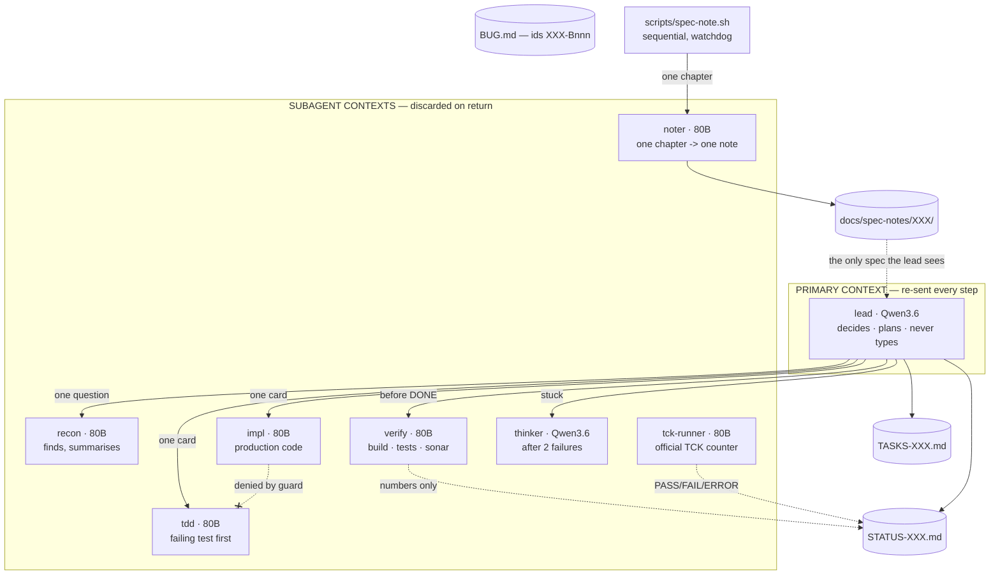
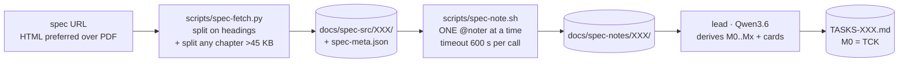
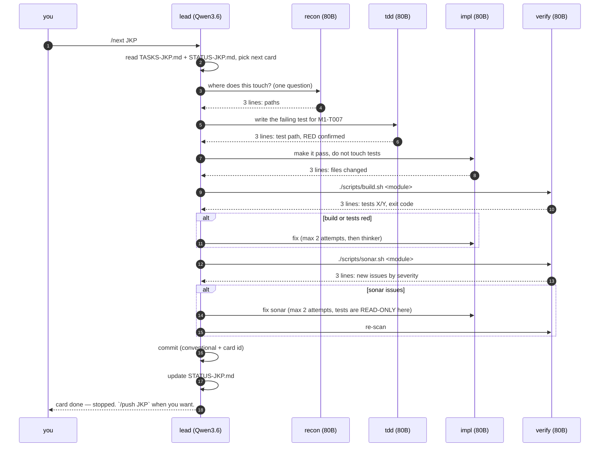
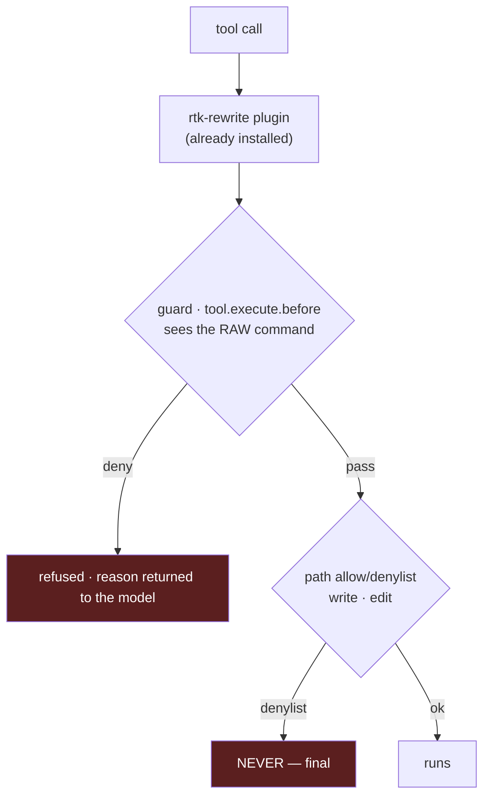

# OPENCODE_CODE_HARNESS — build plan

Design for the OpenCode harness on branch `ybl/jpa-opencode2`. Target: implement
Jakarta specs locally — Persistence 3.2 first, **any spec after** — with agent
contexts kept small on purpose.

Every rule below is anchored on a number measured on this machine, either from
the Vibe V3 session logs (`ybl/jpa-vibe:VIBE_V3.md`) or from the oMLX model bench
of 6–9 Sep 2026. Nothing here is a preference.

> **Reading order.** `AGENTS.md` is the contract agents load; it is short and
> written in caveman English. This file is the reasoning behind it, for humans.
> Agents do not read this file.

---

## 1. Why this shape

V3 measured, over 10 sessions and 1 701 steps, where the primary agent's context
actually came from:

| Source of primary context | Share |
| --- | --- |
| `read_file` | 42% |
| `bash` (build output, searches) | 28% |
| `write_file` + `edit` | 21% |
| `task` returns — real delegation | **4.6%** |

**72% of the primary's context was delegable work it did itself.** That single
asymmetry drives the whole design: a subagent's context is **discarded on
return**, the primary's is **re-sent on every step**.

Three pathologies, all measured, all of which the guard must make impossible:

- **218 `find` calls, 124 distinct** — the same `find … EntityModel.java` ran
  **75 times**, across three spellings differing only by a stderr redirect.
- **476 `read_file` calls, 40% of them re-reading an unchanged file.**
- **262 Maven runs, all logged `exit_code: 0`** — while 38 outputs contained
  `BUILD FAILURE`, 3 compile errors, 17 test failures. See §8.

---

## 2. Models

Two models stay resident: 22.0 + 47.1 = **69.1 GB**, under the ~84 GB oMLX model
ceiling, both answering without eviction (`max_concurrent_requests = 2`).
No swapping — swapping would throw away each model's prefix cache.

The split is not "big model for hard things". It follows **who pays what**: the
primary re-sends a long context every step, so it pays **prefill**; a subagent
starts fresh and short, so it pays **task wall-clock**.

| | Prefill @60k | Same code task |
| --- | --- | --- |
| `Qwen3.6-35B-A3B-MTPLX` (22 GB) | **2 515 tok/s** | 40 s, 4 700 tok (4 300 reasoning) — 10/10 |
| `Qwen3-Next-80B-Instruct-4bit` (47 GB) | 1 730 tok/s | **4.5 s, 348 tok** — 10/10 |

Same quality, opposite cost profiles. Hence:

| Agent | Model | Writes | Exists because |
| --- | --- | --- | --- |
| `lead` (primary) | Qwen3.6 | `TASKS-XXX.md`, `STATUS-XXX.md` | Decides and never types. Fastest prefill = cheapest primary. |
| `recon` | Instruct 80B | nothing | Answers "where is X" so the primary never greps. |
| `noter` | Instruct 80B | `docs/spec-notes/XXX/` only | `recon` may not write, and the lead must never hold a chapter. |
| `planner` | Instruct 80B | `.fragments/<group>.md` only | Turns one group of notes into card rows. Never sees the whole plan. |
| `tdd` | Instruct 80B | `**/src/test/**` only | Writes the failing test **before** the code. |
| `impl` | Instruct 80B | production code, never tests | 9× faster per task than the 35B, same score. |
| `verify` | Instruct 80B | nothing | Runs build/tests/Sonar, returns numbers only. |
| `thinker` | Qwen3.6 | nothing | Only after two failed attempts. Native thinking. |
| `tck-runner` | Instruct 80B | nothing | Runs the official TCK, reports the counter, fixes nothing. |

The 8B vision model is **not** in the roster, and neither is a PDF converter.
This section originally claimed oMLX exposed markitdown for spec PDFs — it does
not, and no converter exists on this machine. Jakarta publishes every spec as
HTML, which the fetcher now prefers: stdlib only, and headings survive the split.
Add vision only if a genuinely graphical diagram ever blocks a card.



**Every subagent returns a verdict of at most 3 lines.** Never raw build output,
never a file dump. The primary must never see a build log in its life — that is
the 28% `bash` line in §1.

---

## 3. Files, one set per spec

A spec gets a **three-letter code** (`JKP` = Jakarta Persistence). You pass it;
`/spec-add` refuses a code already present.

| File | Owner | Content |
| --- | --- | --- |
| `TASKS-XXX.md` | `spec-tasks.sh` | Milestones `M0..Mx`, cards `M0-T001`… Assembled by script from planner fragments; **no model writes this file**. |
| `docs/spec-src/XXX/milestones.tsv` | you | `<name><TAB><note globs>`, one line per milestone, **in dependency order**. The one judgement the script cannot make. |
| `STATUS-XXX.md` | `lead` + `verify` | Current card, measured counters, one line per finished card. |
| `docs/spec-notes/XXX/<chapter>.md` | `noter` | One note per spec chapter, 200 lines max. The only thing read when planning. |
| `docs/spec-src/XXX/spec-meta.json` | `spec-fetch.py` | Chapter list **and TCK coordinates**. What makes the harness reusable: `/tck` reads it instead of guessing. |
| `BUG.md` | `lead` | **Existing file, existing format** (34 entries). Bugs get ids `XXX-Bnnn`. |

No `BUGS-XXX.md`: the workspace `CLAUDE.md` already mandates one `BUG.md` per
sub-project, and two bug registers is how bugs get lost. The `XXX-` prefix gives
per-spec filtering for free.

---

## 4. Commands

| Command | Does |
| --- | --- |
| `/spec-add <url\|path> <XXX>` | Fetch → markitdown → split → one note per chapter → derive `TASKS-XXX.md` + empty `STATUS-XXX.md`. |
| `/tck XXX` | Run the official TCK, report the counter. Fixes nothing. |
| `/next XXX` | One card, end to end, then **stop**. |
| `/fixbug XXX-Bnnn` | Same engine, entry point is a `BUG.md` id instead of a card. |
| `/status XXX` | Read-only summary. No model call beyond formatting. |
| `/push XXX` | Explicit. `/next` commits, it never pushes (see §6). |

---

## 5. `/spec-add` — why it is a pipeline, not a read

A Jakarta spec is hundreds of pages. It does not fit a context, and "summarise
the spec" in one call dies of compaction before writing a single card.



The primary reads **only the notes**, never the spec. Each `noter` call is a
fresh short context that is thrown away. Restartable: a chapter whose note
already exists is skipped, so an interrupted run resumes where it stopped.

Four rules in that diagram were each bought with a failed run:

- **The dispatch loop is a shell, not the lead.** The lead once fired all 39
  noter calls at a server with `max_concurrent_requests: 2`: 9 active, 7 queued,
  prompt processing down from 1 730 to **170 tok/s**, and one call never came
  back — the run stayed "alive" for **51 minutes without writing a file**.
  Sequential is not the slow option: ~47 s per note, 24 chapters in ~20 min,
  against 90 minutes of nothing. **Do not parallelise AI calls against a server
  that serialises them** — no throughput gained, all observability lost.
- **A hard `timeout` per call.** A hung call must die in 600 s, not never.
- **Split any chapter over 45 KB.** Given 80 KB, a noter read it and replied
  *"what would you like me to do with this specification?"* — the spec had pushed
  its system prompt out of reach. The task is also repeated in the message.
- **Count `REPORTED-BUT-MISSING` separately from failure.** An agent claiming it
  wrote a file is not evidence; the script `ls` it afterwards. The final line is
  `notes: n/total written, n skipped, n timed out, n reported-but-missing`.

Front matter (preamble, license, bibliography, appendices) is filtered **by
pattern**, before any model call: 39 chapters become 24 at zero token cost.

### From notes to cards — the same lesson, one level up

The lead then had to turn 24 notes into `TASKS-XXX.md`, and failed three times
with **exit code 0 and no error**. Not a context problem: all 24 notes measure
**34 913 tokens** (server `count_tokens`) against a 65 536 limit, and it died at
21 000. The ceiling was `output: 12288` — a reasoning model asked to emit a
hundred-card document in one response, truncated mid-generation, surfacing as an
empty turn. Raising it to 32 768 moved the wall without removing it.

So `scripts/spec-tasks.sh` takes the document away from the model entirely:

- **one `@planner` call per milestone group**, sequential, watchdog per call;
- the planner emits **rows only** — `| title | spec sections | done-when |`;
- **no id column**: the script assigns `M3-T007`, so no model can invent a
  duplicate id;
- **rows that do not match the shape are deleted**, never trusted. Prose is
  dropped rather than assembled;
- **M0 is generated from `spec-meta.json` with no model at all.** A previous run
  wrote `jakarta.tack:persistence-tck` — a typo inside Maven coordinates, failing
  hours later for no visible reason. Coordinates are now copied by `python3`;
- **milestone order comes from `milestones.tsv`**, not from a model. Ordering is
  a judgement, so it lives in a ten-line file you can edit; fanning out calls is
  mechanical, so it lives in the shell;
- the script **counts what it cannot judge**: cards bundling 4+ requirements in
  one done-when, and duplicate titles across groups.

A dry run at `--timeout 1` — ten deliberate failures, zero tokens — caught the bug
that mattered: the loop processed *one* group and stopped, because `opencode` was
reading the TSV from stdin and swallowing it. `</dev/null` fixed it. Rehearse the
plumbing before spending a single token on it.

---

## 6. `/next XXX` — one card



Three deliberate constraints:

- **Test before code.** `tdd` writes a RED test; `impl` cannot write into
  `**/src/test/**` — enforced by path denylist, not by asking politely.
- **Sonar fix cannot touch tests.** The most tempting way to clear an issue is to
  delete the assertion. During the Sonar phase, tests are read-only for everyone.
- **Two attempts, then `thinker`.** No unbounded fix loops.
- **Commit yes, push no.** A commit is local and revertible; a push publishes. An
  unattended command should not publish. `/push XXX` is yours to type.

The commit is not free-form. The workspace `CLAUDE.md` mandates: message in
**English**, **Conventional Commits** + project ticket, **GPG-signed**, DCO
`Signed-off-by`, and a `Co-Authored-By` trailer naming the AI tool — author and
committer stay **the human alone**, the trailer being honest provenance, not
authorship. So a card commit looks like:

```
feat(persistence): add IdentityMap to the persistence context [JKP M1-T007]

Co-Authored-By: <local model / harness>
```

Commit with `git commit -S -s`: `-s` fills `Signed-off-by` from git config
(`yann@durand-blazart.fr` here). Never hardcode an identity in a command.

`git commit -S` must succeed or the card is not DONE — a failed signature is a
red build, not a warning.

---

## 7. The TCK is milestone zero

The first `TASKS-JKP.md` this harness generated contained **58 cards and zero
occurrences of the word "TCK"** — a plan describing what to implement, with no
way for anyone to know it worked. That is exactly how attempt 1 reached 2/1745
and attempt 3 marked 24 cards DONE against a real counter of 2.

The fix belongs in the harness, not in a hand-written module, or the next spec
starts from nothing again:

- **`scripts/tck-find.py <keyword> [--spec-version X.Y]`** scans the local M2 and
  **opens each candidate jar to count test classes**, because names lie:
  `persistence-tck` is a POM-only aggregator, `-dist` an 8 KB stub, `-common`
  156 KB of support code, and only `persistence-tck-spec-tests` holds the 161
  test classes. Recommending by name sent an agent after a coordinate that
  cannot resolve, and it made the build green by deleting the dependency. The
  recommendation now ships its evidence: `(161 test classes in the jar)`.
  Ranking by test count alone then picked a **4.0.0-SNAPSHOT** jar — 321 classes,
  the TCK of the *next* spec — so the spec version pins the TCK version
  (`spec-fetch.py` derives it from the URL) and a release beats a SNAPSHOT.
  **The TCK version comes from the spec, never from what happens to be
  installed.** `--spec-version` is a hard constraint, not a preference: `3.2`
  matches `3.2`, `3.2.1`, `3.2.2-SNAPSHOT`, never `4.0` and never `3.20`; no
  match returns nothing rather than something wrong. `spec-fetch.py` derives it
  from the URL, so `TitiToto 4.3` looks for the TitiToto 4.3 TCK.
  A lookup that finds nothing usable prints `NO RUNNABLE TCK: <reason>` and
  **exits 1** — the earlier version printed the artifact list, said nothing, and
  exited 0, which is the very failure this script exists to prevent.
  Verified: `data` → `jakarta.data:jakarta.data-tck:1.0.1`; `persistence 9.9`
  and an unknown keyword → exit 1 with the reason. It also surfaces the two runners
  that already pass here (`mansart-data-tck` at 74/74, `mansart-transactions-tck`),
  so an agent copies a working layout instead of inventing one.
- **`spec-fetch.py` writes the coordinates into `spec-meta.json`**, keyword and
  version derived from the url. `/tck` reads that file rather than guessing.
  **`spec-fetch.py <XXX> --refresh-tck`** redoes the lookup alone — no download,
  no re-split — because the TCK moves (installed, upgraded, purged) while the
  spec text never does. Without it, refreshing coordinates meant re-running the
  whole ingestion, and the shortcut was to hand-edit `spec-meta.json`: a file
  that is sometimes generated and sometimes typed is a file nobody can trust.
  It prints `before:` / `after:` and exits 1 when nothing runnable matches.
  Both scripts had the same argument bug: a flag taking a value
  (`--tck-keyword`, `--spec-version`) left that value in the positional list, so
  the command printed usage instead of running. Fixed in both; worth checking in
  any new script before blaming a model for "not calling it right".
- **`/tck XXX` + agent `tck-runner`**: runs, writes nothing, reports four lines.
  Written into its prompt: *ZERO PASS IS A VALID RESULT*, and `ERROR=all` (the
  harness does not compile) is not the same information as a conformance failure.
- **M0 is always the TCK**, before any implementation milestone, and it has three
  shapes because **"no TCK installed" is not "no TCK exists"** — the gap between
  those two is where a project invents a substitute metric:
  a runnable jar in the M2 → build the runner; the spec and version known but no
  jar → **M0-T001 is "obtain and install the official TCK", done-when
  `tck-find.py <kw> --spec-version <x.y>` exits 0 with >0 test classes**; nothing
  known at all → decide and document a metric, explicitly.
  The last card is always "the TCK produces a counter, ANY counter".

On spec dependencies, the answer was smaller than expected: **JNDI is not a
Jakarta spec** — `javax.naming` ships in the JDK. The TCK's `jakarta.tck:common`
drags in the whole EE platform (`ejb`, `jms`, `servlet`, `el`…), but that is the
shared base of every Jakarta TCK, not what JPA needs at runtime. What JPA actually
requires — Transactions, CDI, Annotations, JDBC, a pool — already exists in this
ecosystem as `mansart-transactions`, `vauban` and `mansart-pool`.

---

## 8. Enforcement, and the Maven exit-code fix

OpenCode 1.18.20 exposes `tool.execute.before` / `tool.execute.after` /
`permission.ask` (verified in `@opencode-ai/plugin`), so the V3 guard ports over.



**The guard normalises first**, then decides: strip a leading `cd X &&`, strip
`rtk`, strip trailing stderr redirects. V3 measured **730 of 1 312 bash calls
arriving through `rtk`**, and the 75 duplicate searches were spread over three
spellings — an exact string compare would have caught none of them.

Guard rules: deny direct/piped `mvn`; deny writes into TCK paths; deny a third
identical search in a session; deny re-reading a file unchanged since last read
(same mtime+size+window); deny `cat` of a file over 200 lines (use `sed -n`).
Declared non-strict: **a crash in the guard lets the call through with a
warning**. A buggy guard must never brick a session; the path denylist stays the
hard guarantee.

### The exit-code bug — the one that matters

`mvn … | tail -5` returns **tail's** exit code, which is always 0. That is how
262 Maven runs were logged green while 38 had failed. Two fixes, both needed:

1. **`scripts/build.sh` is the only way to run Maven.** It sets `pipefail`, sends
   the full log to a file, prints ~5 lines (tests run/failed, first error), and
   **exits with Maven's real code**. This fixes the exit code *and* the 28%
   context share in one move.
2. **The guard denies any `mvn`/`mvnw` outside that script**, piped or not —
   because a permission denylist matches command prefixes *after* a tree-sitter
   parse has split on pipes, so it can never express "mvn must not be piped".
   Only a hook that sees the raw string can.

`scripts/sonar.sh` follows the same contract: module-scoped scan, short summary,
real exit code.

---

## 9. rtk and context-mode

- **rtk** stays: the `rtk-rewrite.js` plugin offers every bash command to
  `rtk rewrite`. The guard must therefore normalise `rtk` away before comparing
  commands (see §8), or duplicate-detection silently stops working.
- **context-mode** is how a subagent handles a large output without pouring it
  into a context: process it and print only the answer. Applies to build logs,
  Sonar reports, long greps. `verify` uses it by default; combined with
  `build.sh`, the primary sees numbers, never streams.

---

## 10. Measured environment facts

**SonarQube is up.** Container `vidocq-sonar`, image `sonarqube:community`,
version 26.5.0, **published on port 9001** (not 9000), volumes
`mansart-sonar-{data,logs,exts}`. It stops with OrbStack, so `scripts/sonar.sh`
must **start the container if needed and wait for `/api/system/status` = UP**
before scanning, instead of assuming it is running. Still missing: no
`sonar-maven-plugin` declared in any POM, and no project token — both are part of
the Sonar work item.

**Memory: two resident models fit, KV quantisation is not needed.** Measured with
Qwen3.6 *and* Instruct 80B loaded and a 60k context prefilled on each:

| | |
| --- | --- |
| weights reported by oMLX | 64.4 GB (ceiling grew to 107.5 GB) |
| system memory free | **85%** |
| prefill 60k while sharing | 2 056 tok/s (35B) · 1 583 tok/s (80B) |

So `turboquant_kv_enabled` stays **off**. It would trade throughput — on prefill,
which is exactly what the primary pays — to solve a pressure problem that does
not exist. Revisit only if both models ever need 120k contexts at the same time.
Note the cohabitation tax: prefill drops ~10-20% versus a model measured alone
(2 056 vs 2 515 for the 35B), which is the real price of keeping both resident,
and it is worth it against reload-per-switch.

**An oMLX upgrade wipes the prefix cache.** 0.6.2 → 0.6.4 took it from 42 GB to
12 MB. Any cache measurement spanning an upgrade compares two different machines;
`max_concurrent_requests` (2) and `hot_cache_max_size` (8 GB) survived it.

**Spec source is a URL, and HTML beats PDF.** `/spec-add <url> <XXX>` downloads
the spec and caches it under `docs/spec-src/XXX/`. Given a PDF url it switches to
the HTML edition Jakarta publishes alongside it — there is no PDF converter on
this machine, and HTML keeps the headings the splitter needs. Measured on JPA
3.2: 2.5 MB, 1.22 M characters, 20 chapters, 39 after the 45 KB split. `ee/` is
empty and no spec ships with the repo, so nothing is read from the working tree.

## 11. Built and verified so far

**Refusal works, and it teaches.** Verified end to end on 2026-09-09 with
`opencode run` against `Qwen3-Next-80B-Instruct`: throwing from
`tool.execute.before` refuses the call **and the message reaches the model**,
which corrected itself without being asked —

```
$ mvn -v
Error: mansart-guard: raw maven is denied. Use ./scripts/build.sh instead — …
$ ./scripts/build.sh -v            ← the model's own next move
OK (exit 0)
log: …/target/build-logs/build-20260909-115802-88440.log
```

So the guard is a teaching layer, not just a wall. Everything in §8 stands.

| Piece | State |
| --- | --- |
| `scripts/build.sh` | done — **10/10** on its contract, real failure → exit 1 + 3-line cause, 66-line log → 2 lines of stdout, JDK pinned from `.sdkmanrc` |
| `scripts/test-build-sh.sh` | done — run it before trusting any change to build.sh |
| `.sdkmanrc` | added (`java=25.0.3-tem`, `maven=3.9.16`), taken from `ybl/jpa-opencode` |
| `.opencode/guard-rules.mjs` | done — the six rules as pure functions, **outside `plugin/`** (see traps below) |
| `.opencode/plugin/mansart-guard.js` | done — wires the rules into `tool.execute.before` |
| `scripts/test-guard.mjs` | done — **44/44** |
| `scripts/spec-fetch.py` | done — HTML preferred, splits >45 KB chapters, writes `spec-meta.json` with TCK coordinates |
| `scripts/spec-note.sh` | done — 24 notes, **1 463 lines**, 35 min, 0 reported-but-missing |
| `scripts/spec-tasks.sh` | done — 11 milestones, **248 cards**, 10/10 groups, M0 generated with no model |
| `scripts/tck-find.py` | done — generic, verified on `persistence` and `data` |
| `.opencode/package.json` | `{"type":"module"}`, else Node reparses the plugin on every load |
| `opencode.json` (project) | declares the two working models; **no secret** — baseURL and apiKey inherited from the global provider |
| `~/.config/opencode/opencode.json` | cleaned: it declared two models deleted from oMLX. Now the 5 real ones, default `Qwen3.6`, small/vision `Qwen3-VL-8B`. Backup kept as `opencode.json.BEFORE-CLEANUP-*` |

### Two traps found the hard way

**A plugin file must export exactly one symbol.** OpenCode loads *every* export
of a plugin file as a plugin, calls it with `{directory}`, and dies on the first
one returning `null` — `plugin config hook failed: null is not an object`, and
the whole session is lost. Exporting the rules next to the plugin killed every
run until they moved to `.opencode/guard-rules.js`. The test imports from there
too, so rules stay unit-testable without being loaded as plugins.

**rtk rewrites the command before the guard sees it.** `cat BUG.md` becomes
`rtk read BUG.md`; after `normalise()` strips the `rtk`, a `cat`-only pattern
matches nothing and the rule silently stops firing. Measured: `rtk read` does
**not** truncate (346 lines in, 346 out), so the rule is still needed — it now
matches `cat` and `read`. Any future rule must be written against the
**rewritten** form, not the one a human would type.

**JDK pinning.** `build.sh` resolves `java=` from `.sdkmanrc` and exports
`JAVA_HOME` itself, because an agent shell never runs `sdk env` — a run compiled
with Java 26 while the repo pins 25. A missing pinned JDK exits **78**
(EX_CONFIG): a machine problem, not a build failure. Every summary line now ends
with `jdk: <version>` so a wrong compiler is visible in the 3-line verdict.

Plugin discovery: `.opencode/plugin/` at the project root is picked up
(`[mansart-guard] loaded (dir=…)` on every run).

## 12. Agents and commands — written and loaded

`.opencode/agent/*.md` and `.opencode/command/*.md`, frontmatter + caveman English
body. `opencode agent list` shows all nine: `lead` (primary), `recon`, `noter`,
`planner`, `tdd`, `impl`, `verify`, `thinker`, `tck-runner` (subagents). Six
commands: `/spec-add`, `/tck`, `/next`, `/fixbug`, `/status`, `/push`.

Enforcement is layered, not repeated: `recon`/`verify`/`thinker`/`tck-runner`
have `tools: {write,edit,patch: false}` so they *cannot* write at all; `tdd`,
`impl` and `noter` can write, and stay in their lane by instruction plus the
guard. `noter` is the sharpest case: it is never *handed* an output path, it
**derives** it from the chapter path (`spec-src/XXX/f.md` → `spec-notes/XXX/f.md`).
A note once landed one directory too high, was reported as success, and held the
count at 8 of 11 for twenty minutes. You cannot mistype a path you never receive.

`scripts/sonar.sh` is written and **verified against the real server**: it starts
`vidocq-sonar` if OrbStack stopped it, waits for `status: UP`, and scans. Two
things learned running it:

- **The scanner refuses `-pl`** — *"Maven session does not declare a top level
  project"*. Scope with `-Dsonar.inclusions=<module>/**` instead.
- **The plugin is invoked by coordinates**, not declared in any POM, so the build
  stays clean for anyone who does not run Sonar. No POM change needed.
- Without `SONAR_TOKEN` it **skips with exit 0** and says so, rather than breaking
  `/next`.

`/status JKP` was run end to end: `$ARGUMENTS` substitutes, the command routes to
`lead`, and the output respects the required shape.

## 13. Open points

- **Card granularity is unsolved, and prompting will not solve it.** The pipeline
  produces 248 cards shaped like spec sections, 39 of them bundling four or more
  requirements in one done-when. Hardening the planner prompt (verb-first titles,
  one assertion per card, the failed example quoted with its correction) killed
  the duplicate titles (3+ → 0) and trimmed the count (309 → 248) but **left the
  shape untouched** — seven of ten groups returned the identical card count. The
  control run settles it: the 35B reasoning model produced **12 cards where the
  80B produced 54**, with the same defect. Two models, two architectures, one
  conclusion: **generating cards from section-structured notes is a
  structure-preserving transformation**. The `noter` works because its task is
  line-by-line; ask a model to group and arbitrate and it mirrors its input.
  Remaining options, both untried: a deterministic splitter (one card per note
  line — 1 463 cards, worse), or letting `/next` split a card at execution time.
- **Note density is proven.** 24 notes, 1 463 lines, against 367 lines for 11
  chapters before the 45 KB split. That fix worked.
- **The roster may have the models backwards for `noter`.** Under load, the lead
  replaying a near-identical context reaches **17 250 tok/s** of apparent prefill
  (almost all cache hits), while the noter, reading 39 different chapters, gets
  **274 tok/s** with no cache at all. The role that benefits least from the prefix
  cache was handed to the model that prefills slowest. Testable — same chapter,
  both models — and untested.
- **`/tck` has run once; `/next` never.** The run built a correct runner module
  (build.sh test-compile exit 0, verified) but produced **one test, one skipped**
  — zero official tests, so no counter at all, which is not the same thing as
  `PASS=0`. M0-T002 was "satisfied" by deleting the TCK dependency; the card now
  says in its own text that this is not a fix.
- **The M2 has been purged of the Jakarta Persistence TCK** (41 MB, backed up
  outside the repository). A harness that only works with the suite pre-installed
  by hand proves nothing, so M0-T001 is now "install it" and the whole chain is
  exercised from zero. Nothing about JPA resolves from the local M2 today.
- **`impl` writing into `src/test/` is prevented by instruction, not by tooling.**
  OpenCode's `permission.edit` is per-agent but not per-path here, and the guard
  cannot see which agent issued a call. If an `impl` ever edits a test to go
  green, this is the hole it went through.
- **Thermal drift**: this machine loses up to 61% throughput after ~1 h of
  sustained load and recovers in ~3 min idle. It does not change the design, but
  it explains slow sessions — and it invalidates any benchmark run back-to-back.
  See the `omlx-model-bench` memory.
