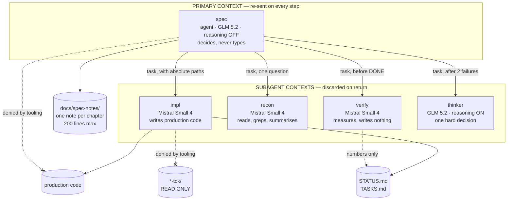
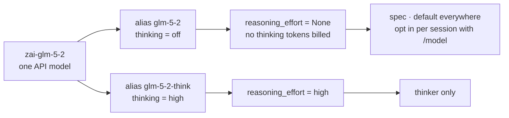
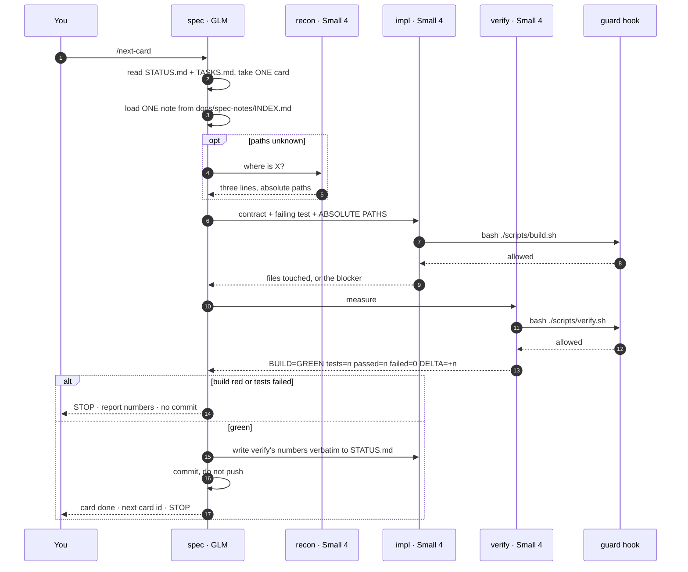
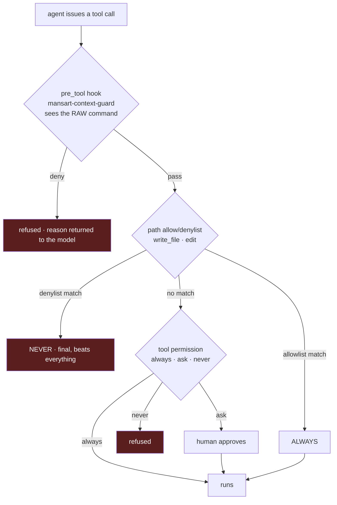
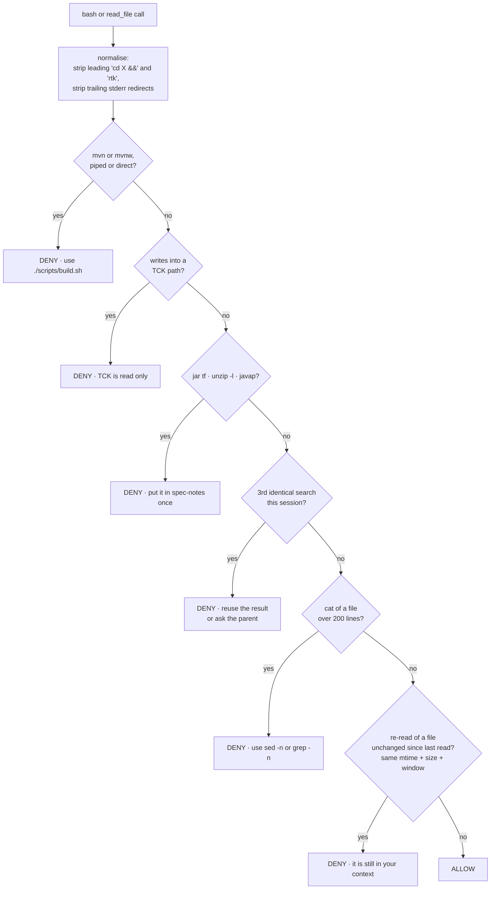
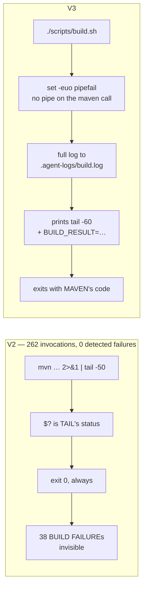
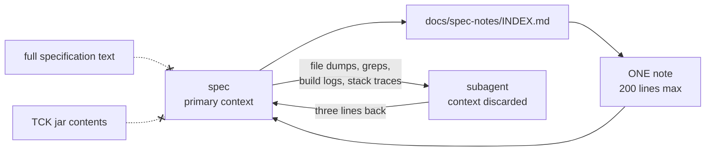

# VIBE_V3 — how the mansart agent harness works

Third iteration of the Mistral Vibe setup driving `mansart-jakarta-persistence`
on branch `ybl/jpa-vibe`. V1 and V2 are described in
`HOW_TO_DEV_WITH_MISTRAL.md`; this document describes what actually runs today
and, more importantly, **why each piece exists** — every rule here is anchored
on a number measured from the session logs, not on a preference.

> **Reading order.** `AGENTS.md` is the contract agents load every session and
> is deliberately short. This file is the explanation behind it, for humans.
> Agents do not read this file.

---

## 1. The measurement that produced V3

10 sessions on `ybl/jpa-vibe`, 3–6 Sep 2026, from
`~/.vibe/logs/session/*/meta.json` and 39 transcripts:

| | |
| --- | --- |
| cost | **$43.98** |
| cards delivered | 24 of 112 |
| steps | 1 701 |
| input / output tokens | 138 M / 581 k — a ratio of **238:1** |
| input served from cache | 90.6% |
| context per step | **81 000** |
| share of the bill that is input | **93%** |

Two conclusions follow, and V3 is built on them.

**Input volume is the cost.** Output is a rounding error. The choice of
reasoning model moves ~1% of the bill — GLM 5.2 and Medium 3.5 have
near-identical *input* prices. Nothing in V3 claims that switching to GLM
saved money; it did not, and was never meant to.

**The expensive model was carrying the cheap work.** Where the primary
context came from:

| Source, primary context | share |
| --- | --- |
| `read_file` | 42% |
| `bash` — build output, searches | 28% |
| `write_file` + `edit` | 21% |
| `task` returns, i.e. real delegation | **4.6%** |

**72% of the primary context was delegable work the primary did itself.** A
subagent's context is discarded when it returns; the primary's is re-sent on
every step until the session ends. That one asymmetry is the whole design.

Three specific pathologies, all measured:

- **218 `find` calls, 124 distinct.** The identical
  `find … -name "EntityModel.java"` ran **75 times**, across three spellings
  differing only by their stderr redirect.
- **476 `read_file` calls, 190 of them (40%) re-reading an unchanged file**
  already read in that session.
- **262 Maven invocations, all logged `exit_code: 0`** — while 38 outputs
  contained `BUILD FAILURE`, 3 compilation errors, 17 test failures.

---

## 2. The roster



| Agent | Type | Model | Reasoning | Writes | Exists because |
| --- | --- | --- | --- | --- | --- |
| `spec` | agent | `glm-5-2` | off | `docs/spec-notes/` only | Someone must decide; nobody must decide *and* type. |
| `impl` | subagent | `mistral-small-4` | off | everything except `*-tck/` | 8× cheaper output, 10× cheaper input, and its reading is discarded. |
| `recon` | subagent | `mistral-small-4` | off | nothing | Vibe's builtin `explore` inherits the *session* model — every "where is X" would run on GLM. |
| `verify` | subagent | `mistral-small-4` | off | nothing | 24 cards were marked DONE while the conformance counter stayed at 2/0/2. |
| `thinker` | subagent | `glm-5-2-think` | **on** | nothing | The only place thinking tokens — billed as output — are worth paying for. |

**Reasoning is off by default.** Vibe has no per-agent reasoning switch:
`thinking` is a property of the *model*. So `zai-glm-5-2` is declared twice,
under two aliases, and only `thinker` gets the thinking one.



Two facts about the levels, verified in
`vibe/core/llm/backend/mistral.py::_THINKING_TO_REASONING_EFFORT`:
`medium`, `high` and `max` **all map to `high`** — `max` buys nothing; and
`low` maps to `none`, so `low` is also off, just confusingly spelled.

---

## 3. One card, end to end

Driven by the `next-card` skill — `/next-card` runs all of it without
intermediate prompts. Of 32 prompts typed over three days, 12 were mechanical
relaunches that produced nothing.



The final STOP is load-bearing. The most expensive session in the measurement
— **$19.55, 44% of a three-day bill** — was one that never restarted: 757
steps on a context that only ever grew.

---

## 4. Enforcement: four layers, and what each can actually stop

A rule stated in a prompt is a suggestion. These are the layers that make some
of them facts.



| Layer | Enforces | Cannot enforce |
| --- | --- | --- |
| **Path denylist** on `write_file`/`edit` | `impl` cannot write into any `*-tck/`. A denylist match returns `NEVER`, final. | Anything done through a shell — it never sees a redirect. |
| **`pre_tool` hook** | The raw command string: unpiped builds, TCK writes via shell, archive dumps, repeat searches, unchanged re-reads. | Nothing it is not written to catch. Fails **open** by design. |
| **`bash = "always"`** everywhere | Nothing — deliberately. See below. | Anything; the hook carries this weight instead. |
| **`allowed_models`** | `/model` and any routing fallback can only reach four aliases. `mistral-medium-3.5` is undeclared. | — |

**Why the hook is not optional.** `tools.bash.denylist` matches command
*prefixes* against parts that a tree-sitter parse has already split on pipes
(`bash.py::_extract_commands`). `mvn … | tail` becomes two independent parts,
`mvn …` and `tail`. **No permission rule can express "mvn must not be piped",
because it never sees the pipe.** A `pre_tool` hook receives
`tool_input.command` intact, and can.

**Why `bash` is `always` and not `ask`.** The first draft of V3 set
`permission = "ask"` on `spec` and `impl`, reasoning that a shell can write
into a TCK directory and the path denylist cannot see a redirect. That reason
stopped being true once the hook gained the `TCK path + write` rule: hooks run
**before** the permission prompt, so the guarantee holds at any permission
level. What `ask` did still buy was interruptions — Vibe's `OUTSIDE_DIRECTORY`
check prompts on every command touching a path outside the workdir, and
`permission = "always"` short-circuits `_is_unconditionally_allowed` before
that check. So `ask` was costing a prompt per call and protecting nothing the
hook did not already protect. It was removed.

The lesson generalises: **put a guarantee in the layer that can actually
express it, then stop paying for it twice.**

### The guard's rules



Normalisation matters: **730 of 1 312 bash calls arrive through the `rtk`
proxy**, and the 75 identical searches were spread across three spellings. An
exact-string comparison would have caught none of them.

The guard is declared `strict = false`: any crash lets the call through with a
warning. A bug in a guard must never brick a session — the path denylist
remains the hard guarantee.

---

## 5. The build exit-code fix

The single most consequential bug in V2, and it was not in the model.



In a pipeline, `$?` is the *last* command's status. `tail` always succeeds, so
Maven's verdict was destroyed before anyone could read it — and the rule "only
commit if the build passes" was not mechanically checkable.

Acceptance test, run against a throwaway project with a deliberate
compilation error:

| | exit code |
| --- | --- |
| `mvn … 2>&1 \| tail -5` on a broken build | **0** ← the bug |
| `./scripts/build.sh` on the same broken build | **1**, `BUILD_RESULT=FAILURE` |
| `./scripts/build.sh` after fixing the error | **0**, `BUILD_RESULT=SUCCESS` |

`verify.sh` goes further: it counts tests from the **surefire XML**, not from
console prose, because a build can print `BUILD SUCCESS` while a suite was
skipped. `tests=0` after a green build is reported as a failure.

---

## 6. Context economy



The rules, in `AGENTS.md`:

- **Target ≤ 30 000 tokens of context per step.**
- Read `docs/spec-notes/*.md`, never the full specification. Start from
  `INDEX.md` and load **one** note. 200 lines per note, then it splits.
- Never inspect archive contents. Never `cat` over 200 lines. Never repeat a
  search. **When delegating, always pass absolute paths.**
- One session, one card.

**`auto_compact_threshold = 60000`** — an absolute count of context tokens
(`stats.context_tokens`), not a percentage of the window. Lowered from 800 000.
A session working correctly never reaches it; a session that has drifted to
double its budget gets cut back rather than quietly billed. Compaction uses
Small 4 and a project-specific prompt (`.vibe/prompts/mansart-compact.md`)
producing a fixed-section handoff — card, contract, **measured** TCK baseline,
files, tests, next step — and explicitly excluding spec reasoning, which
already lives on disk.

Prompt caching is **not configurable**; there is no cache key in the Vibe
schema. It keys off a stable request prefix, so the strategy is: keep
`AGENTS.md` short and stable, do not override the primary agent's system
prompt, and push everything volatile into subagents. **Delegation is the
caching strategy.**

---

## 7. What does not exist in vibe 2.24.5

Verified against the installed package. No workaround was invented for these.

| Wanted | Reality |
| --- | --- |
| Step cap per agent or subagent | **Does not exist.** `max_turns` is not a config key nor an agent override — only the CLI flag `--max-turns`, and only in `-p` mode. `TaskArgs` carries just `task` and `agent`. |
| Token or cost cap per session | **Not in config.** `--max-tokens`, `--max-price`, CLI, `-p` mode only. |
| Prefix-caching setting | **Does not exist.** `cached_input_price` is a display field. |
| Reasoning token budget | **Does not exist.** Only `thinking`, whose five names collapse to two values. |
| Disable auto-compaction | **Does not exist.** Only the threshold can move. |
| "`mvn` followed by a filter" as a permission pattern | **Not expressible** — the parse splits on pipes first. Handled by the hook instead. |

One trap worth remembering: `system_prompt_id` **replaces** Vibe's builtin
`cli` system prompt rather than extending it. That is fine for subagents — the
builtin `explore` does exactly this — but the primary agent would lose 136
lines of harness discipline. `spec` therefore keeps `cli`, and its role is
carried by `AGENTS.md`, which Vibe appends as project instructions.

---

## 8. File map

```
mansart/
├── AGENTS.md                     contract, auto-loaded every session, short and stable
├── VIBE_V3.md                    this file — humans only
├── scripts/
│   ├── build.sh                  the ONLY sanctioned Maven entry point
│   └── verify.sh                 measurement; counts from surefire XML
├── docs/spec-notes/
│   ├── INDEX.md                  one row per chapter → load exactly one note
│   ├── README.md                 per-note template
│   └── NN-<chapter>.md           ≤ 200 lines each
└── .vibe/
    ├── config.toml               models, aliases, thresholds, allowed_models, tools
    ├── hooks.toml                declares the pre_tool guard
    ├── hooks/guard-context.py    the guard itself, stdlib only, fails open
    ├── agents/{spec,impl,recon,verify,thinker}.toml
    ├── prompts/{impl,recon,verify,thinker,spec,mansart-compact}.md
    ├── skills/next-card/         the unattended card loop
    └── archive/agents-v1/        the previous 8-agent roster, kept for reference
```

The hook command walks up from `$PWD` to find the directory owning `.vibe`, so
starting `vibe` inside a sub-module still resolves it.

---

## 9. First measured runs

Two sessions have now run on the new harness.

| | V2 — 11 sessions | V3 — 2 sessions |
| --- | --- | --- |
| context per session | 86 165 mean | **52 087 mean** — 53 117 and 51 057 |
| steps | 181.6 mean | 297 and 13 |
| subagent runs | 2.9 mean | **41 and 4** |
| hook denials | — | **50** |

**−40% of context, and delegation up roughly fourteenfold** on the long
session. Not the −59% an earlier draft of this section claimed: that figure
was read off a session that was still running, at step 25 of what became 297.
A number taken from a live session is not a measurement — the same mistake,
in miniature, that this whole harness exists to prevent.

**The guard fired 50 times**, and what it refused is the interesting part. The
agent kept reaching for exactly the behaviours the V2 measurement had
predicted:

| refused | count |
| --- | --- |
| repeated a search already run in this session | 20 |
| piped a build command, discarding its exit code | 12 |
| re-read a file unchanged since it last read it | 10 |
| called `mvn` directly instead of the scripts | 6 |
| `cat file` into `tail` | 1 |
| `find … -exec` — hardwired to prompt at any permission level | added after |
| wrote build output to `/tmp` | 1 |

These rules are not describing a hypothetical failure mode. Left unenforced,
they are simply what the model does.

Caveats, stated plainly. Two sessions are two data points, not a trend.
`read_file` was still 51% and 71% of tool volume — the 30 000 target is not
reached, and the remaining distance is exactly there: files the primary reads
itself instead of asking `recon`.

### Honest accounting of what buys what

Replaying the V3 rules against the recorded V2 transcripts:

| | projected context / step |
| --- | --- |
| V2, measured | 89 500 |
| + guard hook | 80 200 |
| + delegating 75% of the delegable volume | **43 300** |
| + `auto_compact_threshold = 60000` | hard ceiling |

**The guards buy 12%. Delegation buys the rest.** Neither reaches 30 000 alone;
the last stretch comes from ending the session when the card is done, and no
configuration can do that part.

---

## 10. Operating it

```bash
cd ~/projects/perso/vidocq/mansart && vibe   # default agent: spec
```

Then `/next-card` for the full unattended loop. A subagent can be run directly
— `vibe --agent verify "…"` — but it cannot delegate further.

| Command | Effect |
| --- | --- |
| `/next-card` | one card, start to finish, no relaunch prompts |
| `/reload` | reload config, agent instructions and skills from disk |
| `/model glm-5-2-think` | reasoning ON for this session — remember to switch back |
| `/bootstrap-plan` | regenerate `PLAN.md` / `TASKS.md` / `STATUS.md` |

**Escape hatches.** Guard too aggressive → comment the `[[hooks]]` block in
`.vibe/hooks.toml`, then `/reload`. Too many approval prompts → set
`permission = "always"` under `[tools.bash]` in the offending agent file and
`/reload`; you lose the shell-side TCK guarantee, the path denylist remains.

**After each session**, three numbers decide whether it worked:

```bash
F=$(ls -td ~/.vibe/logs/session/*/ | head -1)
python3 -c "import json;s=json.load(open('$F/meta.json'))['stats'];print(
 'context/step :',s['context_tokens'],'(V2: 81000, target: 30000)');print(
 'hook denials :',s['tool_calls_hook_denied']);print(
 'steps        :',s['steps'])"
```

`context_tokens` is the verdict. A handful of hook denials means the guard is
working; dozens means it is in the way, and the re-read rule is the first one
to relax (`if n >= 1` → `if n >= 2` in `guard_read_file`).

If you see `spec` opening files in series instead of calling `recon`, the
problem is not in the configuration.
